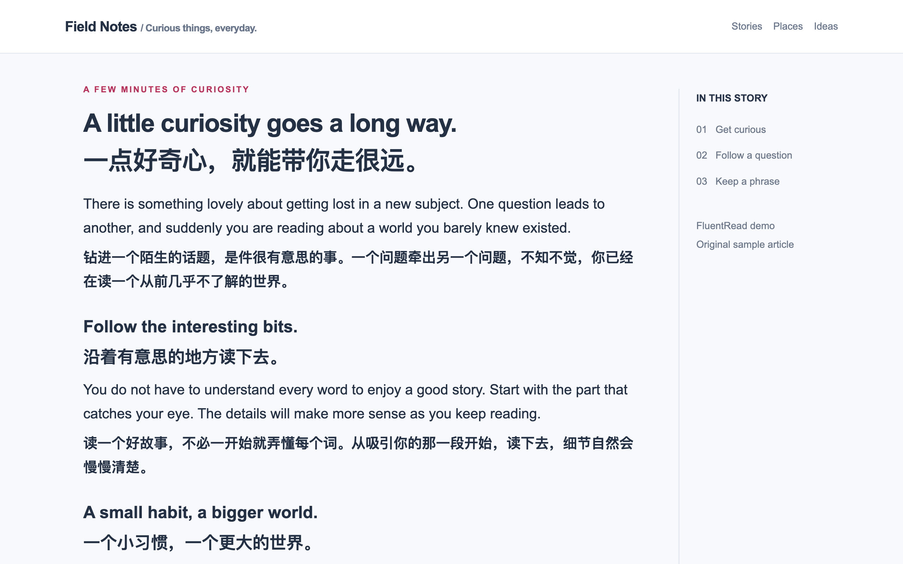
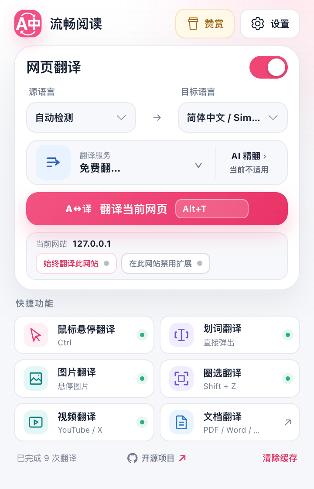
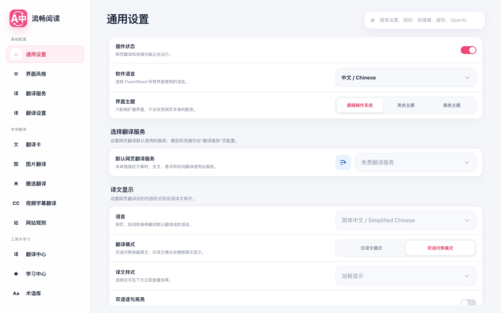
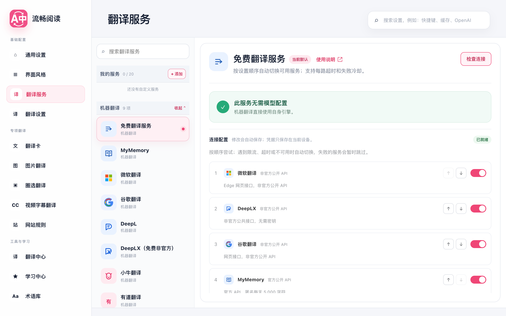

# FluentRead

### Read more. Switch less.

An open-source browser extension that helps you understand foreign-language webpages without leaving the page.

 

**[Install](#install)** · **[See what it does](#what-you-can-do)** · **[Read the docs](https://fluent.thinkstu.com/)** · **[简体中文](./misc/README_ZH.md)**

  

FluentRead puts translation back into the reading flow. Keep the original beside the translation, check one sentence without translating the whole page, or read a long article in two languages without opening another tab.

## What you can do

| Read naturally | Keep your control |
| --- | --- |
| **Bilingual pages** — Keep the original text and translation together for study, research, news, and technical reading. | **Choose your service** — Start with free translation, or use Microsoft, Google, DeepL, AI services, or a local Ollama model. |
| **Whole-page translation** — Translate an article while preserving its page structure, then restore the original whenever you want. | **Clear settings** — Choose a target language, translation style, theme, website rules, and shortcuts in one place. |
| **Selection translation** — Select a sentence, term, or word and get a focused translation card. | **Privacy you can understand** — FluentRead has no account system or first-party translation server; you choose where translation requests go. |
| **More than plain text** — Translate image text, local documents, and YouTube subtitles where supported. | **Reversible reading** — Change the language or service, then translate again without losing the original page. |

## See it in action

<figure>
  
  <figcaption>The popup keeps the most-used reading actions close at hand.</figcaption>
</figure>

<figure>
  
  <figcaption>Set the language, appearance, website rules, and reading helpers to match your habits.</figcaption>
</figure>

<figure>
  
  <figcaption>Choose a translation service and configure it only when you need to.</figcaption>
</figure>

## Install

| Browser or manager | Link |
| --- | --- |
| Chrome | [Chrome Web Store](https://chromewebstore.google.com/detail/%E6%B5%81%E7%95%85%E9%98%85%E8%AF%BB/djnlaiohfaaifbibleebjggkghlmcpcj?hl=en) · [CrxSoso mirror](https://www.crxsoso.com/webstore/detail/djnlaiohfaaifbibleebjggkghlmcpcj) |
| Edge | [Microsoft Edge Add-ons](https://microsoftedge.microsoft.com/addons/detail/%E6%B5%81%E7%95%85%E9%98%85%E8%AF%BB/kakgmllfpjldjhcnkghpplmlbnmcoflp) |
| Firefox | [Firefox Add-ons](https://addons.mozilla.org/en-US/firefox/addon/%E6%B5%81%E7%95%85%E9%98%85%E8%AF%BB/) |
| Tampermonkey / Violentmonkey / Via | [Greasy Fork userscript](https://greasyfork.org/zh-CN/scripts/482986-%E6%B5%81%E7%95%85%E9%98%85%E8%AF%BB) |

## Start reading

1. Install FluentRead from the store or script manager above.
2. Open a normal webpage and choose a target language.
3. Click “Translate page”, or select a sentence for a quick translation.

The [official documentation](https://fluent.thinkstu.com/) explains the main features, service choices, website rules, and privacy boundaries in plain language.

## Privacy

FluentRead does not run an account system or a first-party translation server. When you use a cloud service, the text you ask to translate is sent to that service. You can choose a local Ollama model to keep more content on your computer. See the [data and privacy guide](https://fluent.thinkstu.com/guide/privacy) for the details.

## Help

To adjust a website's reading area, follow the [custom website rules tutorial](https://fluent.thinkstu.com/guide/custom-site-rules). To add or improve built-in rules, see the [website adaptation contribution guide](./docs/contributing/site-adaptation.md), including examples, fixtures, and validation steps.

- [Common questions](https://fluent.thinkstu.com/guide/faq)
- [GitHub Issues](https://github.com/FluentRead/FluentRead/issues)
- [Bilibili introduction](https://www.bilibili.com/video/BV1ux4y1e73x/)

FluentRead is released under the [GPL-3.0 license](./LICENSE).
