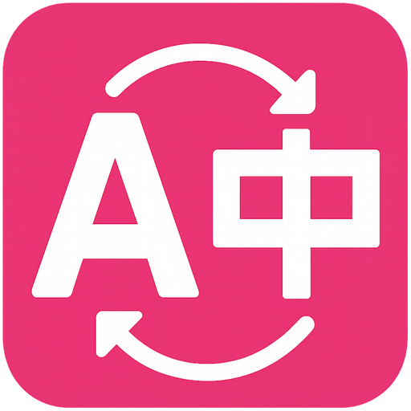
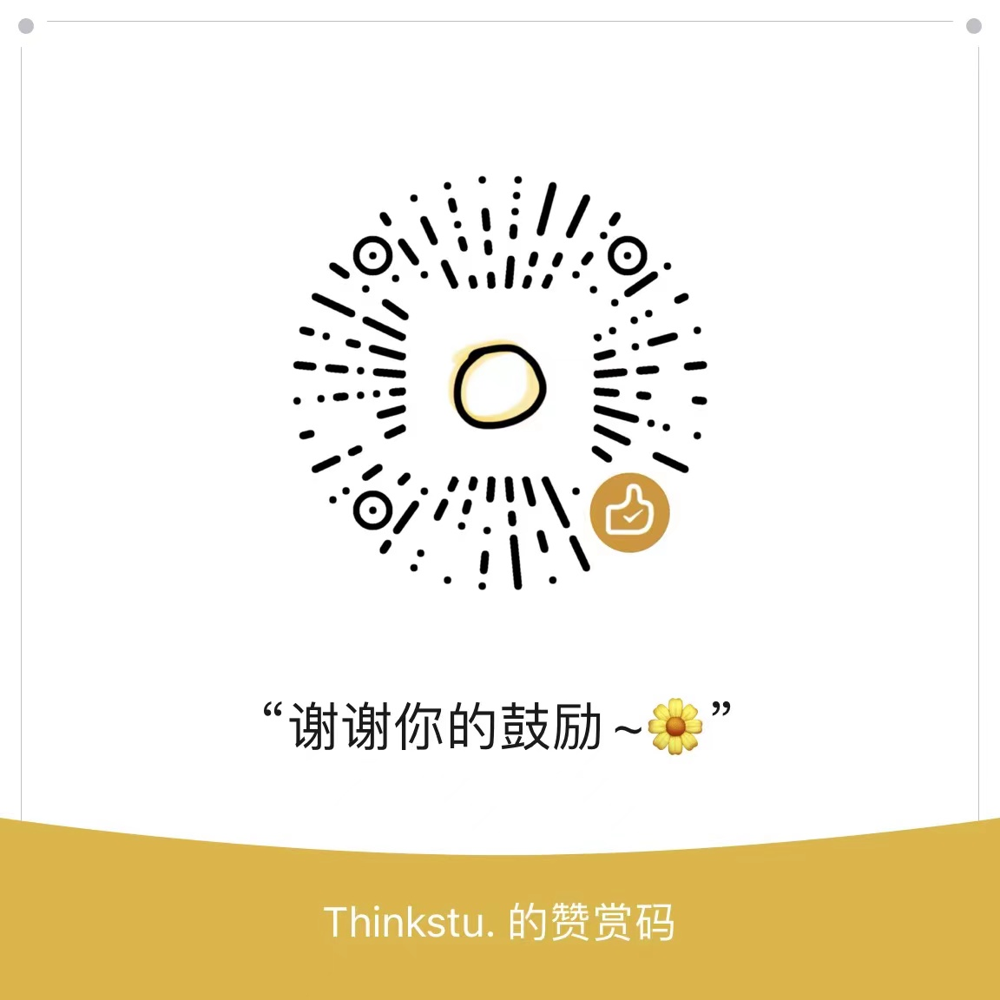

<div align="center">



# FluentRead

An open-source browser extension for bilingual translation.

[Install](#installation) · [Website](https://fluent.thinkstu.com/en/) · [User guide](https://fluent.thinkstu.com/en/guide/) · [简体中文](./misc/README_ZH.md) · [LINUX DO Community](https://linux.do) · [GPL-3.0](./LICENSE)

</div>

FluentRead displays translations alongside the original webpage and provides selection translation, AI reading assistance, image and document translation, and bilingual video subtitles. Its reading card integrates a **browser adaptation of the DeepSeek Harness session core** for contextual explanations and follow-up questions.

[](./docs/public/screenshots/en/translation.webp)

## Features

| Feature | Description |
| --- | --- |
| Webpage translation | Bilingual page translation, hover and selection translation, original-text restoration, and automatic translation rules. |
| AI reading card | Meaning, sentence analysis, usage explanations, and practice, with paragraph context and follow-up questions. |
| Learning center | Save words, phrases, and sentences with their original context for study and review. |
| Image and area translation | Recognize text in webpage images or selected screen areas and display translations that can be copied. |
| Document translation | Read PDF, ePub, DOCX, and other supported formats in two languages, edit translations, and export files. |
| Video subtitles | Bilingual subtitles on YouTube and X; supported X videos can also use local AI transcription. |
| Services and settings | Free translation services, DeepL, AI providers, and local Ollama models, with glossaries, translation styles, shortcuts, and menu layout settings. |

See the [user guide](https://fluent.thinkstu.com/en/guide/) for instructions and supported formats. AI explanations require a configured AI service. Third-party pricing and availability depend on the provider.

## DeepSeek Harness

The reading card adapts the conversation-event and message organization components of the DeepSeek Harness session core for the browser. FluentRead connects these to the selected text, permitted paragraph context, model services, and local reading history. It supports different AI providers and models, with optional learning memories.

The adaptation is used for selection-based reading assistance. Full-page, hover, and regular selection translation use their respective translation pipelines. See the [integration map](./docs/reports/harness-embedding-map-20260905.md) for scope and upstream references, and the [third-party notice](./public/third-party-notices/deepseek-harness-MIT.txt) for its MIT license.

[Reading card guide](https://fluent.thinkstu.com/en/guide/deepseek-harness)

## Installation

[Chrome](https://chromewebstore.google.com/detail/djnlaiohfaaifbibleebjggkghlmcpcj) · [Edge](https://microsoftedge.microsoft.com/addons/detail/kakgmllfpjldjhcnkghpplmlbnmcoflp) · [Firefox](https://addons.mozilla.org/en-US/firefox/addon/%E6%B5%81%E7%95%85%E9%98%85%E8%AF%BB/) · [Userscript](https://greasyfork.org/en/scripts/482986)

1. Install the extension and refresh the webpage.
2. Open FluentRead and select a target language. The source language defaults to automatic detection and can also be selected manually.
3. Choose “Translate page.” Enable selection translation and other tools in settings as needed.

Store updates may arrive at different times. The userscript provides core webpage translation features. See the [installation guide](https://fluent.thinkstu.com/en/guide/getting-started) for browser and feature availability.

## Local development

Requirements: Node.js 20 or later and pnpm 9.

```sh
pnpm install --frozen-lockfile
pnpm dev
```

Use `pnpm build` to build the Chrome extension, `pnpm compile` for type checking, and `pnpm docs:build` to build the website. See [architecture](./docs/architecture.md) and [testing](./docs/testing.md) for project conventions.

## Contributing

Report bugs and propose changes through [Issues](https://github.com/FluentRead/FluentRead/issues). Pull requests for code, documentation, interface translations, and [website adaptation](./docs/contributing/site-adaptation.md) are welcome.

## Support

FluentRead is an open-source project whose continued development is made possible by the generous support of its community. Voluntary contributions are welcome through either service.

<table>
<tr><th>WeChat Support</th><th>Ko-fi · International</th></tr>
<tr>
<td align="center"><a href="./misc/approve.jpg"></a><br />Scan with WeChat. Click the image to enlarge.</td>
<td align="center"><a href="https://ko-fi.com/thinkstu"><strong>Support thinkstu on Ko-fi ↗</strong></a><br /><br />ko-fi.com/thinkstu</td>
</tr>
</table>

## Acknowledgments

FluentRead grows alongside a vibrant open-source community. We are grateful to the following projects and their contributors for their openness and generosity:

- [Read Frog](https://github.com/mengxi-ream/read-frog)
- [KISS Translator](https://github.com/fishjar/kiss-translator)
- [Duo Translator](https://github.com/linuxscreen/duo-translator)

<!-- contributors:start -->
<a href="https://github.com/FluentRead/FluentRead/graphs/contributors">
  <table>
    <tr>
      <th>
        <br>
        <br>
        <br>
      </th>
    </tr>
  </table>
</a>
<!-- contributors:end -->

Thank you to everyone who has contributed to FluentRead, including the many we couldn't name here, and to every user for embracing a product that is still far from perfect. We hope to keep building together with you, and to bring a little more good into the world.

## License and privacy

FluentRead is released under [GPL-3.0](./LICENSE). See [third-party notices](./public/third-party-notices/) for component attribution and licenses.

Cloud translation sends relevant text to the selected provider. See [data and privacy](https://fluent.thinkstu.com/en/guide/privacy) for file parsing, image recognition, and local model behavior.
