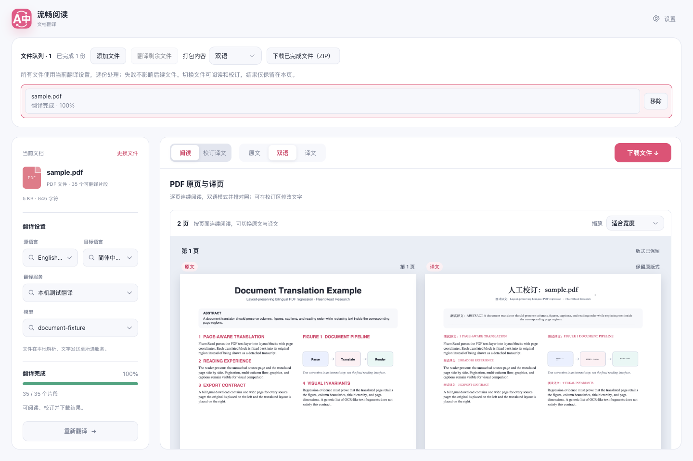

# 文档依赖按需加载与构建警告核查

2026-09-13，基于 `4b537e7e`，分支 `perf/chunk-loading-20260913`。使用 WXT 0.20.18、Vite 5.4.19 的生产构建；GPU/WASM 配置保持现有实现。

## 结果

| 指标 | 修改前 | 修改后 |
| --- | ---: | ---: |
| 文档页入口 JS | 1,025,601 B | 89,447 B |
| 文档页首次实际请求的 JS 合计 | 1,850,713 B | 914,615 B |
| UI 构建组超过 500 kB 的 JS 块数 | 3 | 2 |

文档页首次请求的 JavaScript 减少 936,098 B（50.58%）。测量包含公共依赖，避免把入口变小误当作整体首载收益。这里只测量实际加载字节，未宣称启动耗时或峰值内存按同等比例下降。

安装目录仍约 47.96 MB，拆分增加约 6.7 kB 的模块及加载代码；这轮收益是避免提前解析与执行不需要的库，不是减少安装包总量。

## 加载行为

- 空白文档页及 TXT 导入、翻译、导出：不加载 PDF.js、pdf-lib、JSZip。
- DOCX/ePub 导入或导出、批量 ZIP 下载：首次使用时加载 JSZip，约 97 kB。
- PDF 导入或预览：首次使用时加载 PDF.js，约 408 kB。解析入口显式配置随包 worker，不依赖预览模块的初始化副作用。
- PDF 导出：首次使用时加载 pdf-lib，约 436 kB。
- PDF 文本坐标处理继续使用同步仿射变换；增加缩放、反转及旋转视口回归。预览加载失败后清理失败缓存，允许重试。
- 快捷键弹窗的两个静态导入改为与其余使用者一致的异步导入，消除静态/动态混用警告。专项测试同时发现并修复翻译卡片弹窗确认后未关闭的问题。

## 为什么还保留体积警告

构建已成功。500 kB 是 Vite 对压缩后单个 JS 块的提示，不等于安装包、首次页面加载量或运行时故障。

目前 UI 组剩余两个大块：约 637 kB 的公共 UI/配置代码，以及约 729 kB 的 `defuddle/full` 正文与 Markdown 提取库。后者在扩展页面按需加载；它的上游发布文件本身已是一个完整 bundle，简单指定 `manualChunks` 不能继续切开其内部模块。

WXT 0.20.18 将内容脚本和独立 Worker 按 IIFE 库模式构建，不能对所有构建组统一套用网页的 ESM 拆包配置。内容脚本还需遵守既有 CSP 与动态资源地址边界。推理 Worker 的脚本体积另列在产物分析中，不与文档页首载混为一谈。

`manualChunks` 控制模块的归属，不自动推迟静态依赖加载。[Rollup 官方文档](https://rollupjs.org/configuration-options/#output-manualchunks)也说明手动分块可能改变带副作用模块的执行时机。本次使用明确的功能触发点做动态加载，保留默认警告阈值。

## 验证与复现

- TypeScript/Vue 编译、Chrome 与 Firefox 生产构建、扩展 manifest 验证通过。
- 文档二进制、批量任务、设置架构、源码规范定向测试 665 项通过；浏览器防抢焦点、模块边界及验证归属等 136 项通过（两组有设置架构用例重叠，不相加为唯一用例数）。
- 二进制服务的 statements、branches、functions、lines 覆盖率均为 100%。
- 隔离 Edge 实测 TXT、DOCX、ePub、PDF 导入、通过本机确定性服务翻译、人工校订、原格式下载，以及批量 ZIP 下载通过；PDF 预览与 150% 缩放正常，控制台错误为 0。
- 翻译卡片与快捷翻译方案的两个异步快捷键弹窗均通过确认、关闭及持久保存验证，控制台错误为 0。
- Firefox 本轮是构建验证；未运行真实 Firefox、完整模型推理或真实供应商翻译质量测试。首次优化版浏览器启动曾未发现 service worker，manifest、background 与内容脚本哈希均与基线一致；新临时 profile 重试后专项通过。

构建与依赖图可用 `pnpm build --analyze`，目录体积可用 `pnpm analyze:bundle`。文档浏览器脚本现支持限定场景：

```sh
node scripts/testing/run-resource-safe.mjs -- node scripts/run-document-translation-test.cjs \
  --suite formats --formats sample.txt,sample.docx,sample.epub,sample.pdf \
  --extension-dir .output/chrome-mv3 \
  --playwright-root <本机 Playwright 包目录> \
  --focus-safe-helper <focus-safe-browser.cjs 的绝对路径> \
  --artifacts-dir <证据目录>
```

快捷键弹窗专项使用 `scripts/testing/run-lazy-options-ui-test.cjs --suite hotkeys`，并传入同类浏览器参数。

[逐阶段加载字节与构建数据](./chunk-loading-20260913/measurements.json)


