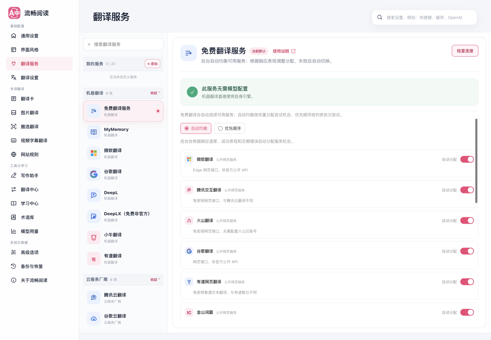
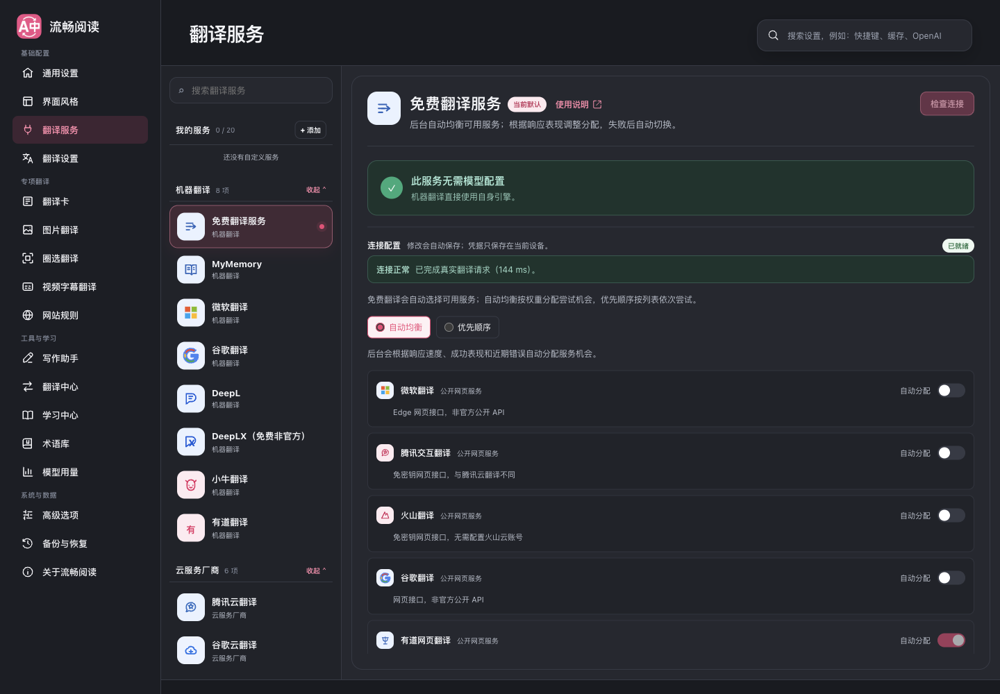
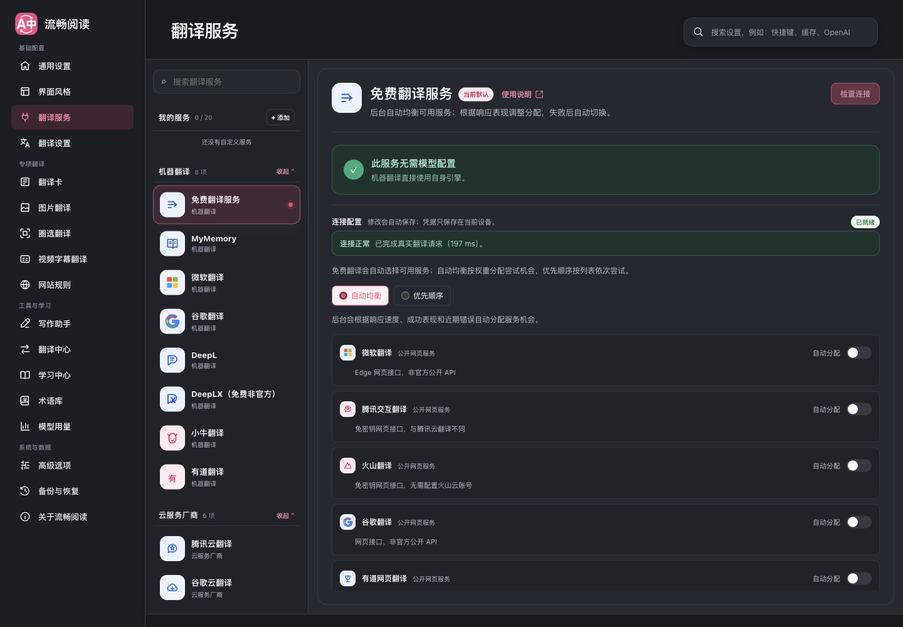

# 免费翻译自动均衡验证

核对日期：2026-09-12。默认微软优先，随后按后台维护的近期成功率和响应耗时动态加权分配；用户只能选择模式、启停服务及调整顺序模式的优先级，不能编辑权重。

新增有道网页翻译、金山词霸、搜狗、Reverso、Lingva、Apertium。共 13 个候选，默认启用 9 个；搜狗、Reverso、Lingva 和无中文方向的 Apertium 默认关闭。免费池不继承独立服务的 Key、Secret、请求头、代理和私有端点。

## 确定性验证

- 全量 Vitest：307 个文件、6,153 项测试通过。
- 新增策略、存储、两组网页适配器，以及重构后的免费路由和 HTTP 错误模块：120 项相关测试通过，statements、branches、functions、lines 均为 100%。
- 测试覆盖动态性能影响实际服务选择、冷却持久化、恢复探测、Retry-After、排队预算、并发限制、挂起存储、迟到响应和取消时序。
- 类型检查、Chrome/Firefox 生产构建、userscript 构建及 verifier 均通过。

## 真实生产扩展

使用独立临时 Edge profile；正常窗口位于第二屏，`macos-background-cdp` / `launchservices-no-foreground`，确认 `browserFrontmost: false`。没有复用用户浏览器或移动系统鼠标。

- 默认自动均衡、微软首位、9 项默认启用、13 项可选、无权重输入控件。
- 服务启停、顺序和模式在重新加载设置页后保持。
- 1440、820、390 像素宽度均无横向溢出；检查明暗主题。
- 隔离启用有道网页翻译：真实连接检查成功，144 ms。
- 隔离启用金山词霸：真实连接检查成功，197 ms。
- 词霸单独启用时，example.com 段落真实执行翻译、恢复、再次翻译，译文节点数量为 1 → 0 → 1，恢复时原文一致。

有道 POST 请求在扩展环境曾返回 403；同一公开端点原生支持 GET。最终适配器使用 GET、无 Cookie、无伪造 Origin，已由上述生产扩展实测确认。

## 证据边界

搜狗当前网络超时、Reverso 和 Lingva 曾遇到访问验证；它们有真实协议适配器和合成响应测试，尚无本轮生产扩展成功证据。Apertium 官方语言对列表已核对，但没有本轮生产扩展翻译成功证据，不支持中文方向。彩云、Papago、LibreTranslate 未取得足够的当前匿名可用证据，本次未作为空适配器加入。

完整 UI 技能脚本已运行，但其持久化用例仍假设“通用设置”中存在旧目标语言控件；当前该位置是界面语言，脚本超时，完整套件不计为通过。上述免费服务专项是独立真实浏览器验证。Firefox 与 userscript 本轮只有构建/产物验证，没有运行时浏览器验证。

实现按 FluentRead 的 Vue/WXT 架构独立完成，没有修改参考仓库或引入跨仓库依赖。机器翻译服务受网络、额度及服务端策略影响，测试成功不代表持续可用性承诺。
