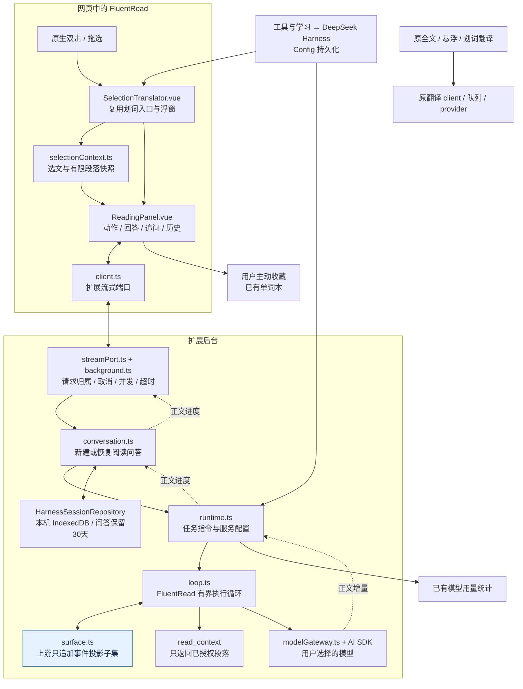

# DeepSeek Harness 内嵌方式与代码地图

核查日期：2026-09-05。核查基线：FluentRead 已提交代码 `5704bb848347c2dcd2791c1bf702c59f3b8dc5ca`。其中本文涉及的 Harness 实现与 PR #440 合并提交 `6b4772981b96d083b00cb37ddd2d6a0f13755895` 相同。本文不把正在进行的阅读交互修复计为已交付功能。

当前实现是：**移植 DeepSeek Harness 会话事件投影的只追加子集，加上 FluentRead 自己的浏览器模型与工具循环、流式通信和阅读问答仓库。** 没有将完整 DeepSeek Harness 包嵌入扩展，也没有运行一个上游后台服务。目前接入的是选区阅读学习；全文、悬浮和原划词翻译仍走原来的翻译链路。

## 1. 实际采用了什么

| 部分 | 实际来源及实现方式 | 本地代码 |
| --- | --- | --- |
| 会话事件投影 | 从上游 `packages/core/session/src/surface.ts` 适配只追加子集；保留三类消息事件、append 标记、连续序号和消息投影 | `src/core/harness/surface.ts` |
| 单次执行循环 | FluentRead 独立实现；把模型消息、工具结果先记入 ledger，再投影给下一次模型调用 | `src/core/harness/loop.ts` |
| 阅读任务 | FluentRead 实现读懂、拆句、用法、练习四套提示词；配置、模型和工具在后台组装 | `src/services/harness/runtime.ts` |
| 模型连接 | 复用 AI SDK 与 FluentRead 已保存的服务配置、凭据和网络边界 | `src/services/harness/modelGateway.ts` |
| 正文流式显示 | AI SDK 消费真实 `text-delta`，通过扩展 runtime port 传到阅读卡 | `runtime.ts`、`src/features/reading-assistant/client.ts`、`streamPort.ts` |
| 30 天阅读记录 | FluentRead 自建会话编排与 IndexedDB 仓库，保存选文、授权段落和问答 | `src/services/harness/conversation.ts`、`src/platform/storage/harnessSessionRepository.ts` |
| 页面入口与设置 | FluentRead 的 Vue 组件、原生选区、现有设置导航和 Config 持久化 | `SelectionTranslator.vue`、`ReadingPanel.vue`、`HarnessSettings.vue` |

采用的上游参考版本为 [`dsh-v0.1.3-alpha.1`](https://github.com/deepseek-ai/deepseek-harness/releases/tag/dsh-v0.1.3-alpha.1)，固定提交为 `d347e703908d0406b7a7ef80e3a0e594d86b2215`。这说明代码采用的版本，不表示报告实时追踪上游最新版本。最初提供的 `dsh-v0.1.2-rc.1` 链接没有作为当前实现的固定来源。

直接参考的[上游 surface.ts](https://github.com/deepseek-ai/deepseek-harness/blob/d347e703908d0406b7a7ef80e3a0e594d86b2215/packages/core/session/src/surface.ts)及其 SHA-256 记录在 `docs/guide/deepseek-harness.md`：`aa75a34df001b33d3b1e4dd5c24a0391d00bc457e0a83f25757d3358b12b684f`。上游 MIT 许可随包保存在 `public/third-party-notices/deepseek-harness-MIT.txt`。

`package.json` 没有 `deepseek-harness` 或 `@deepseek-harness/*` 依赖。相关运行时依赖是 `ai`、`@ai-sdk/openai-compatible`、`@ai-sdk/anthropic`、`@ai-sdk/google`、`zod` 和已有的 `dexie`。因此上游后续升级不会自动进入本插件，需要逐项审查并更新适配代码。

## 2. 哪些模块未引入

PR #440 的合并差异没有删除或重命名文件记录。这里准确的说法是“选择性移植，没有引入下列模块”，不是“整包导入后删除”。

| 上游能力 | 当前处理 | 与浏览器阅读产品的关系 |
| --- | --- | --- |
| CLI、桌面 Web UI | 未引入 | 用户仍在网页选区卡片与 FluentRead 设置页中操作 |
| host / bridge、Cordis 插件加载器 | 未引入 | 后台组合与消息通信由既有扩展架构负责 |
| 文件系统、shell、子进程、沙箱、动态代码执行 | 未引入 | 阅读解释不需要本机执行能力 |
| 远程插件、网页抓取工具 | 未引入 | 模型只能使用本次选区及显式允许的段落快照 |
| 完整上游 Session 持久化、日志恢复 | 未引入 | 本地只保存产品需要的阅读问答 |
| surface replacement、provenance rewrite | 未移植 | 本地 ledger 仅支持追加，不支持上游的历史替换与来源重写语义 |

模型当前只有一个可调用工具：`read_context`。它返回请求开始时捕获的授权段落，不会再次访问 DOM，也不会抓取页面链接。选择“当前选区”模式时，这个工具不提供给模型。

读懂、拆句、用法、练习是四种阅读任务，不是四个工具，也不是确定性语法解析器。单词本收藏由用户点击按钮触发，模型不能自主写入单词本。

## 3. Mermaid 模块地图

图中蓝色节点为上游规则的移植子集，其他节点为 FluentRead 实现或已有能力。箭头表示任务调用或数据传递；原翻译链路单独标出，以准确表示接入范围。



例如用户选中一句话并点击拆句：阅读卡把选文、动作和问题发送到后台；后台解析用户选择的服务与模型；本地循环记录用户消息，再调用模型。如果模型要求段落，循环执行 `read_context`，将工具结果追加为事件，再调用模型。模型正文生成时就显示在卡片中；本地仓库同时保存部分回答及最终状态。

`surface.ts` 在这里解决“哪些事件应成为下一次模型请求中的消息、顺序是否有效”的问题。它不负责模型联网、UI 展示或数据库保存。

## 4. 代码放在哪里

以下路径均相对于 FluentRead 仓库根目录。目录分层沿用项目架构，不新增独立应用、服务器或跨仓库依赖。

```text
src/
├── core/
│   ├── harness/
│   │   ├── surface.ts                 上游只追加事件投影适配
│   │   └── loop.ts                    本地模型与工具循环
│   └── config/harness.ts              动作注册、默认值、配置规范化
├── services/harness/
│   ├── runtime.ts                     阅读提示词、流式生成、只读工具
│   ├── modelGateway.ts                多供应商模型适配
│   ├── conversation.ts                会话恢复、检查点与结束状态
│   ├── sessionTypes.ts                会话与问答数据合同
│   ├── sessions.ts                    字段规范化与30天过期规则
│   └── usage.ts                       接入现有用量统计
├── platform/storage/
│   └── harnessSessionRepository.ts    IndexedDB、删除、并发写入保护
├── features/
│   ├── reading-assistant/
│   │   ├── selectionContext.ts        当前选区及正文段落捕获
│   │   ├── client.ts                  前端流式端口
│   │   ├── streamPort.ts              后台流式端口
│   │   ├── background.ts              请求身份与生命周期
│   │   ├── sessionHandler.ts          历史查询与删除授权
│   │   ├── answerFormat.ts            回答展示格式
│   │   └── ui/ReadingPanel.vue        阅读卡与追问
│   ├── selection-translation/ui/
│   │   └── SelectionTranslator.vue    复用原划词入口和浮窗
│   └── settings/
│       ├── model/navigation.ts        工具与学习菜单入口
│       └── ui/HarnessSettings.vue     Harness 设置和历史管理
└── app/background/
    ├── harnessRuntime.ts              组装模型、仓库、端口与定时清理
    └── messageRuntime.ts              注册到原后台消息体系
```

理解代码可以按这个顺序阅读：`SelectionTranslator.vue` → `ReadingPanel.vue` → `client.ts` → `app/background/harnessRuntime.ts` → `conversation.ts` → `runtime.ts` → `loop.ts` → `surface.ts`。查看数据存储时再读 `sessionTypes.ts`、`sessions.ts` 和 `harnessSessionRepository.ts`。

## 5. 流式和长期会话的准确含义

**流式显示**来自模型真实正文增量：`streamText().fullStream` → `text-delta` → 累计正文快照 → runtime port → 阅读卡。它没有等整段完成后播放打字动画，也不保证每个网络片段恰好一个字符；片段大小由模型服务决定。工具参数和内部推理不会作为正文显示。停止或错误后保留已收到的部分回答。

**长期保存的是阅读问答，而不是完整上游执行现场。** 每轮执行的 `loop.ts` 都会新建 ledger。虽然 loop 返回 ledger，`runtime.ts` 对外只返回正文、服务和模型信息；因此持久化仓库不接收 ledger。

| 本机保存内容 | 不保存为可恢复的 Harness 执行记录 |
| --- | --- |
| 选中文字、已授权段落 | 完整 ledger / surface 事件日志 |
| 问题、回答、学习动作 | 工具调用参数和工具结果事件序列 |
| 生成中、完成、停止、错误状态 | 内部推理事件和模型执行游标 |
| 创建时间、更新时间、服务及模型 | 上游 Session 日志与快照 |

每条问答按自己的 `createdAt` 计算 30 天期限；继续会话不会续期旧问答。选文与授权段落作为会话上下文，随仍未过期的问答保留，直到会话不再包含未过期问答时一起删除，因此它们不是独立按最初捕获时间设置 30 天上限。生成期间约每 500ms 保存一次检查点，结束时保存最终状态。扩展启动、读取历史以及每小时清理时删除过期问答；后台重启把中断生成标为停止。隐私窗口不保存，也不读取普通窗口记录。

恢复记录只读本地数据，不自动请求模型。继续提问时最多取最近 4 轮有回答的问答来构建新请求；不是把 30 天全部记录都发给模型，也不是从上次工具执行的位置继续运行。

```mermaid
sequenceDiagram
    actor User as 用户
    participant Card as 阅读卡
    participant Port as 扩展后台端口
    participant Conversation as 会话编排
    participant Loop as 新建执行循环
    participant Model as 所选模型
    participant DB as 本机问答仓库
    User->>Card: 选句后发起分析或追问
    Card->>Port: 选文、动作、问题、会话ID
    Port->>Conversation: 校验归属后执行
    opt 已有会话
        Conversation->>DB: 读取未过期问答
        DB-->>Conversation: 恢复原文与近期问答
    end
    Conversation->>Loop: 构建本次请求
    Note over Loop: 每次请求新建 ledger，不恢复旧工具现场
    Loop->>Model: 模型消息与可用工具
    loop 正文生成中
        Model-->>Loop: 正文增量
        Loop-->>Conversation: 正文进度
        Conversation-->>Port: 正文进度
        Port-->>Card: 实时显示回答
        Conversation->>DB: 定期保存部分回答
    end
    Conversation->>DB: 保存完成、停止或错误状态
    User->>Card: 查看历史
    Card->>Port: 读取记录
    Port->>DB: 校验后查询本地仓库
    DB-->>Port: 返回原文和问答
    Port-->>Card: 显示记录，不调用模型
```

## 6. 距离全插件统一内核还有什么

当前已连接选区阅读、模型设置、流式回答、阅读问答、用量统计和用户主动收藏。产品目标中的“所有能力由同一个 Harness 串起来”尚未全部实现：原全文、悬浮和划词翻译未迁入；长期记录不是完整事件会话；学习动作仍依赖模型提示词；模型工具目前只有 `read_context`。

本报告是对现有实现的范围核查，不将上述缺口包装为已完成能力。此前的验证及其实际边界见[Harness 阅读学习实现报告](./harness-reading-20260905.md)：其中浏览器证据使用本地 SSE 测试模型，能够证明实际扩展的流式与存储链路，不代表任意远程模型的回答质量。本次报告核查未重新执行那批历史测试。
