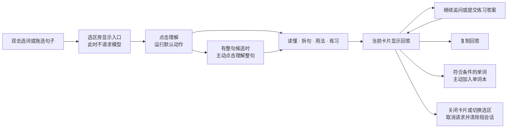
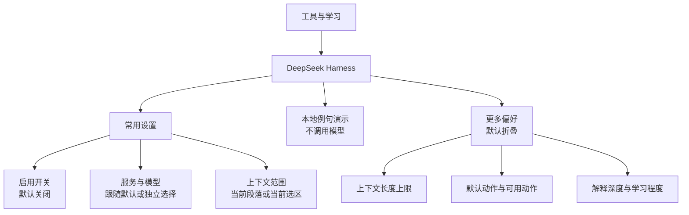
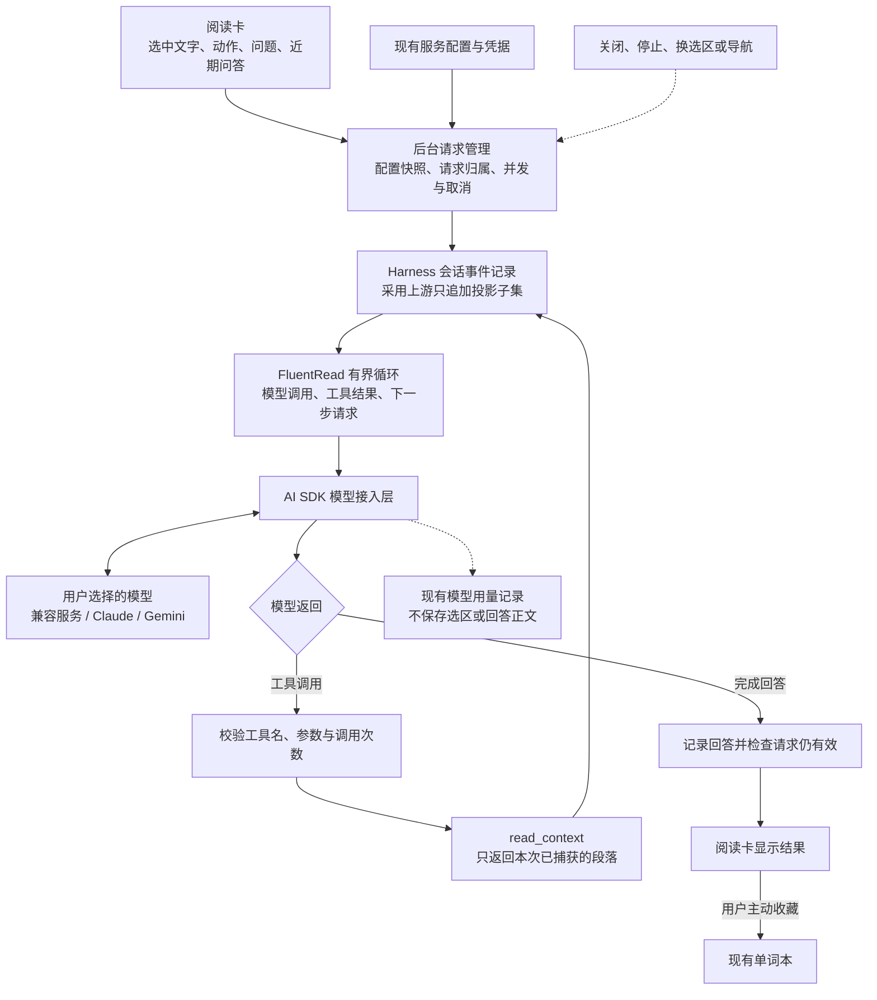

# Harness 阅读学习实现报告（Mermaid 版）

本次从同步后的 `main` 提交 `4d1d9e5` 开发，功能提交为 `a275a05`，工作分支为 `codex/harness-reading-core-20260905`。功能已在本地实现并验证，尚未推送或合并。

当前完成的是“选区阅读学习”与 Harness 的连接。原有全文翻译、悬浮翻译尚未统一迁入 Harness，因此它目前承担阅读学习的内核，而不是全插件所有功能的统一调度内核。

## 已实现的功能

| 能力 | 已实现行为 |
| --- | --- |
| 阅读入口 | 默认关闭；开启后与原有划词翻译共用入口和卡片，选中本身不调用模型，点击“理解”才发起请求。 |
| 理解整句 | 保留网页原生双击选词与拖选；识别到整句候选时，允许用户显式扩展分析对象。 |
| 四个学习动作 | 读懂：解释原意、语气和指代；拆句：解释主干、从句和语法；用法：说明搭配和例句；练习：围绕内容生成一道小练习。 |
| 连续学习 | 在同一卡片追问或提交练习答案，请求保留最多四轮近期问答；界面展示当前结果，关闭后清除短会话。 |
| 结果操作 | 停止、失败重试、复制；符合条件的英文单词可显式加入现有单词本，隐私窗口不提供收藏。 |
| 上下文控制 | 当前选区或当前段落；段落由只读工具取得，默认上限 1500 字符，可配置为 500–4000。 |
| 服务与模型 | 复用已有凭据；可以跟随默认服务及其模型，也能独立选择服务、选择或输入模型名。支持兼容协议与 Claude、Gemini 原生协议。 |
| 设置与引导 | 工具与学习下新增 DeepSeek Harness；提供不联网的例句演示，详细偏好折叠展示并持久保存。 |
| 生命周期 | 停止、关闭、换选区、页面导航或相关设置变化时取消请求；旧回答不能覆盖新选区。 |
| 现有能力连接 | 接入原划词卡、服务配置、单词本、模型用量和配置同步。修复嵌套配置共享导致设置变更未保存的问题。 |

## 产品定位

FluentRead 的阅读学习应当围绕用户正在读的文字展开：先读懂，遇到难点再拆句、学表达，最后通过一道小练习确认自己能用出来。学习入口和原有划词翻译共用一张卡片，保留网页原生的双击与拖选行为。

选中文字只出现“理解”入口。明确点击后，后台才调用模型；需要更多解释时在当前卡片追问。切换到另一个选区或关闭卡片会清理短会话。单词收藏是显式操作，复用现有单词本；模型请求复用服务凭据与模型用量记录。

“工具与学习 → DeepSeek Harness”集中提供开关、服务、模型和上下文范围。默认动作、可用动作、上下文长度、解释深度、学习程度放在折叠的“更多偏好”中。页面例句是本地交互演示，不产生模型请求。

浏览器截图作为补充证据保留：[阅读卡](harness-reading-20260905/reading-card.png)、[设置页](harness-reading-20260905/settings.png)。阅读卡中的回答来自测试接口。

## 内核与开源来源

固定上游版本为 DeepSeek Harness `dsh-v0.1.3-alpha.1`，提交 `d347e703908d0406b7a7ef80e3a0e594d86b2215`。实际移植的是会话 surface 的只追加事件投影子集；模型／工具循环是适配浏览器的独立有界实现，并非完整上游包。

内核负责把用户消息、模型消息、授权段落工具和追问历史串成一致的会话。FluentRead 的服务层负责模型协议、配置快照、错误与用量，内容层负责选区与卡片。单次请求有模型调用、工具调用、并发与总时限限制，并按 tab/frame/document 归属取消。

当前只实现 `read_context` 一个模型可调用工具；“当前选区”模式不提供它。单词本写入由用户点击触发，不是模型自主调用的工具。循环默认最多进行 4 次模型调用、2 次工具调用，40 秒超时；不会让模型无限运行。

本次复用 AI SDK，新增固定版本的 Anthropic、Google 适配器，使 Claude、Gemini 及已支持的兼容服务保持各自协议。DeepSeek Harness MIT 与新增适配器 Apache 2.0 声明随扩展包分发。没有使用 `read-frog` 或 `kiss-translator` 的代码。

更多来源与范围见[使用指南](../guide/deepseek-harness.md)。

## 当前边界

- 全文翻译、悬浮翻译等现有链路尚未迁入 Harness；本次完成的是阅读学习链路及其与现有能力的连接。
- 四个学习动作由模型生成解释和练习，不是独立语法解析器或确定性的学习评测系统。
- 回答完成后整体显示，尚未提供逐字流式显示。
- 没有长期 Harness 会话、自动复习计划或学习进度追踪；近期问答只在当前卡片内保留。
- 没有完整上游运行时的 replacement、provenance rewrite、持久化 session、CLI、桌面界面、插件加载器或文件／shell 执行能力。
- 模型选择以对应服务实际支持为准；模型不支持工具调用时，可使用“当前选区”模式。

## 已验证

- 全量测试：181 个文件、2,926 个测试通过。
- 严格覆盖率套件：2,219 个测试通过，statements / branches / functions / lines 均为 100%。其后修改的 Vue 初始化副本与配置引用，另经类型检查、构建、38 个相关测试和实际浏览器验证。
- TypeScript/Vue 类型检查、测试归类审计、架构边界检查通过。
- Chrome、Firefox、油猴、文档构建通过，扩展 manifest 与油猴 verifier 通过。
- 阅读专项：生产包在独立 Edge 临时 profile 中通过 16 个真实场景；`launchMode=macos-background-cdp`，`focusPolicy=launchservices-no-foreground`，`browserFrontmost=false`。
- 场景覆盖：默认关闭、选中不发请求、四个动作各自发请求、真实段落工具回合、带问答历史的追问、停止与旧回答隔离、换选区、只发送选区、整句展开、原划词入口共存、窄屏与暗色、设置关闭重开和跨页同步。控制台与 HTTP 错误均为 0。

真实浏览器还发现并修复了设置初始化共享嵌套配置的缺陷：旧逻辑会让界面编辑先污染保存基线，从而被误判为“没有变化”。现在初始化独立的编辑副本；验证记录明确证明开关从 true 改为 false、范围从 selection 改为 paragraph 后，存储与重开界面均保持新值。

专项报告见 [reading-browser-report.json](harness-reading-20260905/reading-browser-report.json)。模型接口在浏览器测试中使用本地 HTTP fixture，验证的是实际产品链路，不代表远程模型的回答质量。Firefox 已完成构建与清单验证，未运行其原生浏览器交互测试。

另外运行了 UI 技能的 `--suite full` 广泛回归，并在临时脚本中适配当前主线的设置导航、配置恢复确认和首次语言引导。执行已通过配置快速关闭与跨页同步、历史恢复、历史窄屏布局，以及 Popup 基础布局与可访问性检查；随后停在“更多服务默认收起”的旧断言，完整套件未全部通过。旧脚本所要求的撤销／重做按钮在当前产品中不存在，未计为通过。本次没有为满足这些旧界面假设修改产品；因此这里的完整测试通过仅指上述单元测试，浏览器验证通过范围以阅读专项 16 个场景为准。
