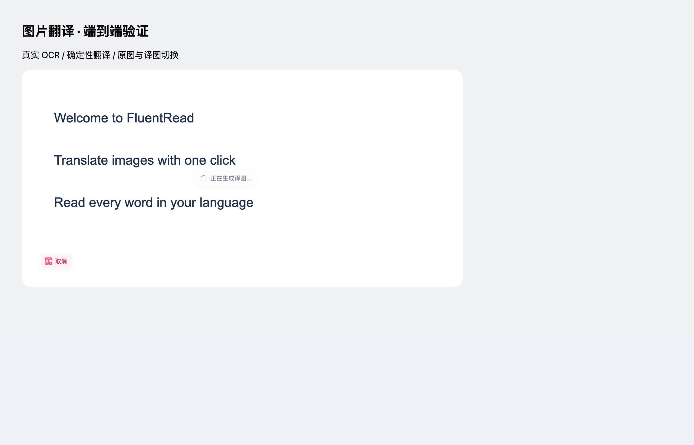
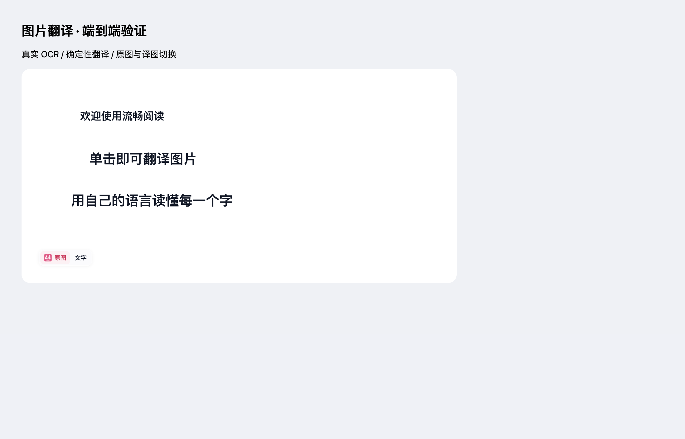

# 图片翻译稳定性修复验证

2026-09-13，基于 `3f2750bd` 的独立分支 `fix/image-translation-stability-20260913`。

## 修改

- 进度更新时保留取消操作条的挂载位置，只有进入或退出错误提示时才移动操作条。
- 整图翻译遇到 runtime 消息通道断开时自动恢复一次。重试采用新请求 ID，并尽力取消旧请求；保留原取消信号和总超时预算。
- 取消、超时、普通服务错误不会自动重试。扩展上下文失效提示刷新页面；重复断线提示重试或刷新，并补齐现有界面语言。

## 浏览器证据

生产 Chrome MV3 产物在临时隔离 Edge 中通过 18 项检查。真实下载语言包、执行 Tesseract OCR 与图像绘制；在线翻译使用确定性 Google transport 夹具。取消悬停检查使用额外的阶段消息重放；连接恢复检查使用真实处理阶段，并主动关闭 Offscreen 文档一次。

| 检查 | 旧生产构建 | 修复版 |
| --- | --- | --- |
| 约 1.2 秒内操作条重新挂载 | 11 次 | 0 次 |
| 连续进度更新时焦点与悬停 | 焦点丢失 | 始终保留 |
| 操作条透明度 | 随重挂载变化 | 始终为 1 |
| 主动关闭 Offscreen | 未在旧版本执行此项 | 新 ID 自动恢复一次，输出一张有效译图 |

取消按钮修复后：

主动中断连接后完成翻译：

还覆盖了语言包准备、完整译文、恢复原图、缓存、布局与裁切、动态换图、取消后迟到结果、透明图片与页面修改透明度、图片移除清理。机器可读结果保存在同目录的 `evidence.json`。

浏览器使用 `macos-background-cdp`，焦点策略为 `launchservices-no-foreground`；窗口在第二块屏幕正常显示，`browserFrontmost=false`。测试临时 profile 已删除，页面异常与清理异常均为空。

## 其他验证

- 7 个相关测试文件，235 项针对性测试通过。
- 两个修改模块的专项覆盖率检查：65 项测试通过，statements/branches/functions/lines 均为 100%（与上项部分重叠）。
- 本地化与源文件头检查：653 项测试通过。
- 测试归类审计、类型检查、Chrome/Firefox 生产构建、文档构建通过。
- `git diff --check` 和浏览器脚本语法检查通过。

## 边界

截图中的错误只能确定消息回复通道提前关闭，缺少原网页与当时日志，无法认定其具体触发原因。本次直接验证了这类中断的单次恢复能力；确定性在线翻译夹具不代表真实供应商鉴权或网络可靠性验证。Firefox 已完成构建验证，未执行 Firefox 浏览器流程。本次未借鉴或修改参考项目。
