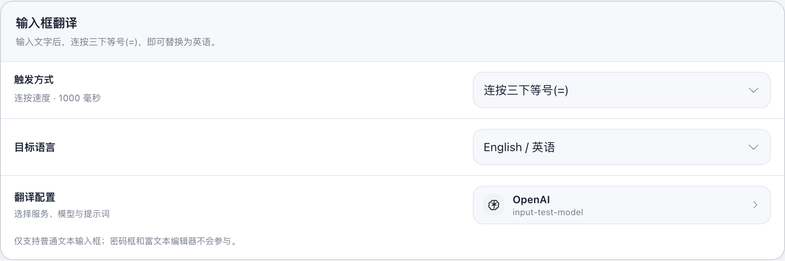
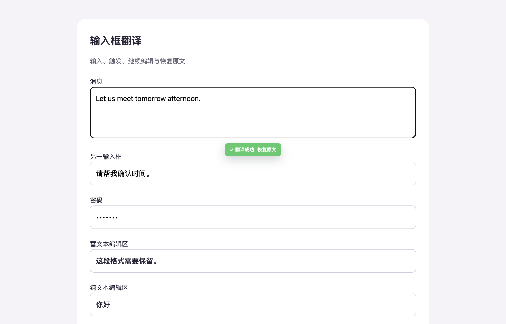

# 输入框翻译独立配置与交互优化

本次将“设置 → 翻译设置 → 输入框翻译”整理为触发方式、目标语言和翻译配置三行。顶部随当前选择说明如何触发，以及输入文字会被替换成哪种语言的译文；连按速度通过点击弹层调整，服务、模型与提示词统一在翻译配置窗口中编辑。

## 配置与默认行为

| 配置 | 默认值与行为 |
| --- | --- |
| 触发方式 | 保留原有设置；新安装仍关闭；支持三击空格、等号和短横线；兼容原有 Ctrl+Enter 设置 |
| 三击间隔 | 点击“连按速度”打开调整弹层；相邻两次按键最大间隔默认为 1000 毫秒，可设置 200～2000 毫秒整数，并恢复默认 |
| 目标语言 | 保留原有设置；新安装为英语 |
| 翻译服务 | 微软，延续原先固定微软的行为；现在可独立选择其他服务 |
| 模型 | 留空使用所选服务的默认模型，可从建议中选择或直接输入模型标识；输入后点击“完成”即可保留，无需先按 Enter |
| 提示词 | 留空使用输入框专用默认提示词；机器翻译与不支持通用提示词的模型不显示此编辑功能 |

翻译配置窗口集中提供服务与模型选择，提示词在窗口内按需展开。提示词支持“从默认提示词开始编辑”，也可以直接写语气或风格要求：执行时会补齐缺失的原文和目标语言变量，保存的自定义文字保持原样。单项重置只清除对应的自定义提示词。服务连接参数继续复用现有服务设置，点击连接设置会关闭当前窗口并跳转到所选服务。

修改自动保存，关闭翻译配置窗口后保留已编辑内容。输入框翻译关闭时仍可预先设置目标语言与翻译配置；这些修改不会自动启用翻译，启用仍由触发方式控制。

为避免升级覆盖偏好，本次保留原有触发方式和目标语言字段，以新增字段扩展独立配置。切换服务只在用户操作时重置专用模型，重新打开设置或同步配置不会清空已保存的模型。

## 网页输入交互

三击只消费同一输入目标和同一连续输入位置的操作。第三键被拦截，原文只排除本次实际插入的两个触发字符，用户原有的空格、等号或短横线保留。修饰键、长按、输入法组合、焦点和光标移动会中断连续计数。

翻译请求固定输入快照、编辑版本和配置版本。继续编辑、修改后改回、按 Esc 取消、配置更新或页面卸载，均不能让失效请求覆盖当前内容。成功提示在 8 秒内提供恢复原文；文本已经再次编辑时，恢复操作也不能覆盖编辑结果。密码框、不可编辑控件和富文本编辑器保持不参与。

实际浏览器验证修复了两处用户可感知的问题：失焦产生的同值 `change` 不再被误当成新编辑，点击恢复原文可以正常生效；动画提示清除互相冲突的行内透明度，避免按钮存在却不可见。用户脚本设置还会等待已保存配置加载完成，再允许编辑和保存，避免用初始化默认值覆盖旧设置。

后台和用户脚本共用输入翻译处理器，从本地配置建立一次请求快照，再调用现有翻译服务与缓存。网页消息只携带文字和目标语言。输入请求自动识别源语言，关闭网页上下文和网页默认术语干预，遵循用户的缓存开关，独立提示词参与原有缓存标识。

## 验证范围

使用本地确定性供应商响应验证实际请求中的服务、模型和提示词；这不是外部服务认证或真实模型翻译质量测评。真实浏览器使用生产 Chrome MV3 产物、临时 Edge profile、第二屏后台窗口，未操作用户日常浏览器页面。Firefox 与用户脚本执行构建验证，未将 Edge 的浏览器结果表述为其运行时验证。

浏览器专项 **13/13 通过**，页面运行时错误为零。覆盖间隔弹层保存与恢复默认、自定义模型输入后直接完成、关闭状态预先配置而不自动启用、从默认提示词开始编辑/保存/重置、全空白提示词的默认语义、独立模型/提示词请求、保留全局设置、翻译后恢复并再次翻译、慢速三击不触发、继续编辑保护、仅失焦仍可完成、Esc 取消、失败重试、密码与富文本排除、三种连按和 Ctrl+Enter、修改间隔后无需刷新网页。配置窗口在 390 像素窄屏和 600 像素高窗口中均保持边界完整，标题和完成按钮固定可见；成功提示另有可见性断言（opacity 1、display block、visibility visible）。[结构化浏览器证据](./browser-evidence.json)保留确定性请求内容与执行方式。

| 检查 | 结果 |
| --- | --- |
| 完整 Vitest，单 worker | 302 文件、6088 测试通过 |
| 严格覆盖率，单 worker | 245 文件、4966 测试通过；statements/branches/functions/lines 均为 100% |
| 最终界面本地化与 UI 架构检查 | 72 测试通过，随后浏览器 13 项通过 |
| TypeScript / Vue 类型检查 | `pnpm compile` 通过 |
| 测试归类与覆盖率规则审计 | `pnpm test:audit` 通过 |
| Chrome MV3、Firefox MV2、Userscript | 三种生产构建通过；扩展清单与 userscript verifier 通过 |
| 文档 | `pnpm docs:build` 通过 |

并行运行全量测试与构建时曾出现既有缓存压力测试超时和全文可见性调度时间断言失败；分开、单 worker 运行后完整测试与严格覆盖率通过，未放宽断言、超时或覆盖率门槛。本轮集成后的验证日志保存在本机 `/private/tmp/fluentread-input-delivery-*.log`。

运行方式为 `macos-background-cdp`，焦点策略 `launchservices-no-foreground`，第二屏正常尺寸后台窗口 `background-visible-no-focus`；测试浏览器没有成为前台应用。

通用扩展 UI 技能的 full runner 未完整跑通：它依赖旧 Popup 标题和“默认目标语言”等旧控件选择器。原始日志为 `/private/tmp/fluentread-input-ui-full.log`，仅更新标题后的日志为 `/private/tmp/fluentread-input-ui-full-current.log`。本次没有删除断言来宣称该套件通过；输入框专项使用当前组件选择器完成保存、重载、390/820 像素宽度和深色模式验证。

### 截图

独立配置卡：

[统一翻译配置窗口](./ai-settings.png) · [提示词编辑](./prompts.png) · [390 像素窄屏](./narrow.png) · [深色模式](./dark.png) · [连按速度](./timing.png) · [窄屏配置窗口](./narrow-profile.png) · [矮窗口提示词编辑](./short-window.png)

真实输入框翻译成功与恢复原文：

## 来源与交付范围

实现基于 FluentRead 自身配置、翻译服务和 Shadow UI 架构，未复制或修改参考项目。工作位于独立 worktree `FluentRead-input-translation-profile-20260912`、分支 `codex/input-translation-profile-20260912`，主检出目录的已有工作不属于本次改动。最终验证已整合主分支 `64cc5e1c`，保留新加入的段落翻译、字体与设置页视口改动，并补齐新增段落测试的归类。
