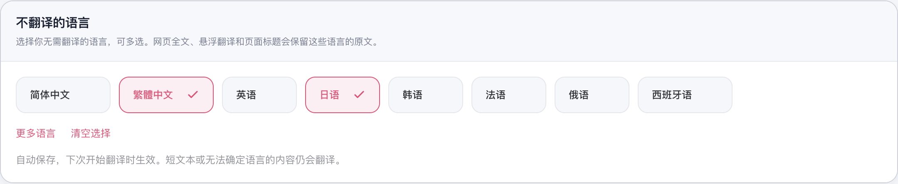
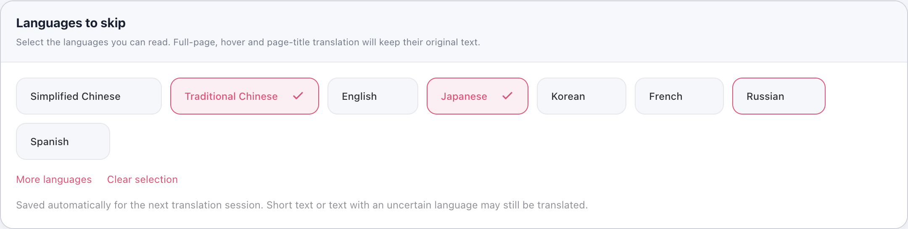
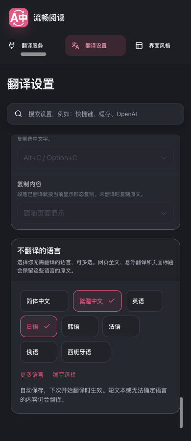

# Issue #627：不翻译的语言

Issue 中用户希望阅读繁体中文时不再自动转换成简体。此前同目标语言预检保留了简繁转换的能力，无法表达用户希望原样阅读某些语言的偏好。

已先向提出者致谢：[issue 评论](https://github.com/FluentRead/FluentRead/issues/627#issuecomment-5681543661)。本次增加独立多选配置，默认空列表，保留现有行为。没有修改版本号或参考仓库，也没有复制参考项目代码。

## 设置与行为

“不翻译的语言”位于翻译设置最底部。常用语言直接展示，其他语言可展开；再次点击取消，收起后保留已选语言，并提供清空入口。标题、说明、按钮和语言名称跟随七种界面语言；简体和繁体分别可选。

配置沿现有 normalizeConfig、设置副本与持久化服务保存，支持旧配置迁移、中文别名、去重和跨页面同步。开始翻译时冻结排除列表，参与会话、批次和结果缓存标识，避免切换规则后复用旧的原文回填结果；邮件子页对新增快照字段进行类型和长度校验。

自动全文、手动全文、悬浮及页面标题按各自文本判断。排除语言不发送翻译请求，富文本槽中的其他语言仍进入请求。恢复、重复翻译和动态内容换成外语仍正常工作。现有目标语言判断、划词、输入框、文档、图片和字幕的规则保持原样。

正在执行的全文会话沿用启动时的配置；调整后先恢复原文再重新开始。语言检测沿用保守边界：短文本、简繁混排或无法可靠判定的内容继续翻译，不用整页 lang 属性直接跳过混合页面。

## 验证

- 主定向回归：11 个文件、1286 项通过，包含中文判定、配置与迁移、配置差分/导出、全文调度/文本槽、标题、i18n、模块边界和文件头。
- 补充回归：6 个文件、733 项通过，包含子页面快照、语言目录、设置架构、i18n、模块边界和文件头；与上一组存在重复测试，不能相加。
- 严格覆盖率：6 个文件、442 项通过。语言目录/检测、网页配置归一化、文本槽请求、标题、子页会话六个源码模块的 statements、branches、functions、lines 均为 100%。
- 类型检查、Chrome MV3 构建、Firefox MV2 构建、userscript 构建及 verifier、双浏览器 manifest 校验和文档构建通过。
- 最终生产构建的隔离 Edge 验证通过：立即关闭后保存、重开、跨页同步、连续修改、键盘多选、展开/收起/清空，以及全部七种界面语言。
- 浅色 1440/1024/820/390 和深色 1440/390 的页面及按钮均无横向溢出；DOM 确认这项配置是翻译设置最后一个分组。
- 五个浏览器翻译场景通过：悬浮排除与相邻英文、全文恢复再翻译与标题、动态内容改成英文、自动全文、清空后恢复繁转简。排除内容零请求，页面和 worker 控制台错误为零。

浏览器使用临时 profile，`launchMode=macos-background-cdp`、`focusPolicy=launchservices-no-foreground`，窗口位于第二屏，`browserFrontmost=false`。本地 HTML 和确定性翻译响应验证配置、请求及 DOM 链路，不证明线上翻译服务质量；Firefox 完成构建与清单验证，未进行 Firefox 实机验证。

测试分类审计与验证归属检查仍存在主分支基线失败：`tests/freeTranslationWeightsHandler.test.ts`、`tests/freeWeights.test.ts` 未进入 test-matrix，`src/app/background/handlers/freeTranslationWeights.ts`、`src/services/translation/freeWeights.ts` 未进入覆盖率清单。已在未修改的基础提交 `525977fd` 导出副本中复现完全相同的问题，本次没有改动这些文件或降低检查要求。

浏览器摘要见 [browser-results.json](./issue-627/browser-results.json)。专项命令与边界见 [测试文档](../testing.md)。

## 实际截图

中文界面：

英文界面：

深色窄屏及页面底部位置：

