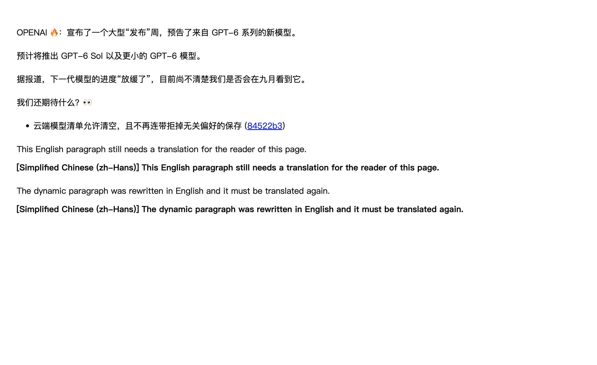
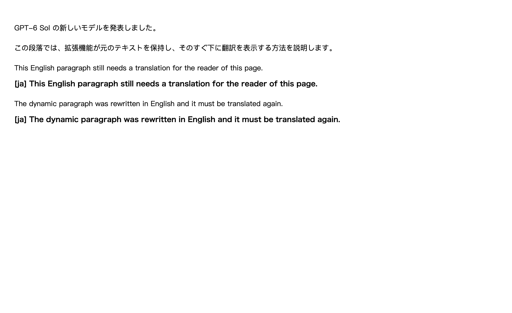

# 同目标语言跳过与统一语言判断

验证日期：2026-09-16。分支：`codex/fix-chinese-target-detection-20260915`，基于本地提交 `2ac7289d`（此前只修复部分中文场景）。

## 通用根因

1. **语言代码没有统一。** franc-min 返回 ISO 639-3，配置使用两字母或 BCP 47 标签；旧 `detectlang` 只映射 6 种语言，德语 `deu`、葡萄牙语 `por`、意大利语 `ita` 等即使识别正确也不等于 `de`/`pt`/`it`。排除语言另有一张映射表，同一文本作为目标语言和排除语言会得到不同结论；划词、MyMemory、本地模型又各有一份表。
2. **只有“字符集快判”和“50 字母以上的统计首位”两条路径。** 少于 50 个字母的 Latin/Cyrillic 文本一律翻译；长文本则无条件相信 franc 首位，没有可靠性判断，导致夹带外语句子的段落、加泰罗尼亚语、加利西亚语、意大利语被当成法语/西班牙语而跳过。
3. **技术标识符和外语正文的处理分散。** 中文、日文、韩文各有一套规则，日韩文里的 `GPT-6 Sol` 被当成外语词。
4. **调用链不一致。** 全文富文本槽在未配置排除语言时只做中日韩字符集快判，同目标德文槽仍被提交；混元服务用“去掉空白后的统计猜测”决定是否短路。

## 行为变化

- `src/core/language/codes.ts` 统一目标语言、排除语言、检测结果和各服务别名：两/三字母代码、ISO 639-2/B、宏语言成员、旧别名、大小写、下划线、地区、脚本和扩展段；非法值、`auto`/`und`/`mul`/`zxx` 返回空代码且不匹配任何语言。配置中的裸 `zh` 仍为简体；检测器给出的裸 `zh`/`cmn` 只表示中文、书写体系未知，不匹配任何简繁目标。粤语与繁体中文、`sr-Latn` 与 `sr` 保持区分。
- `src/core/language/identify.ts` 给出与目标无关、只以文本为缓存键的结论（`empty`/`identified`/`unknown`/`mixed`），`detect.ts` 用同一结论比较目标语言和排除语言。全文候选、富文本槽（无论是否配置排除语言）、批量请求、页面标题、悬浮、划词快捷键、共享翻译客户端、MyMemory 源语言推断和混元自动短路都走这条判断链。
- `technicalTokens.ts` 只在识别副本中遮蔽 URL、邮箱、提及、行内代码、路径、文件名、UUID、提交哈希、版本号、带版本产品/模型名（可带规模、变体词和至多一个首字母大写后缀）、代码标识符和字母数字编号；原文、链接和 DOM 不变。非 Latin 正文中的缩写、内部大写名称和格式名按词计权，不能主导结论。
- `statistical.ts` 把 franc-min 分数只作为同一文本内的排序和分差信号，结合功能词逆文档频率得分和正字法字母反证：决定性功能词、功能词领先且分差达标、功能词持平但分差更大、franc 前两位几乎并列时由功能词打破平局，以及 franc-min 没有模型的目录语言（斯洛伐克语、拉脱维亚语、爱沙尼亚语等）的功能词专用路径。分差阈值随字母数缩放。加泰罗尼亚语、加利西亚语、南非荷兰语、马其顿语、白俄罗斯语和哈萨克语的功能词作为反证。
- 单一语言文字（希腊文、希伯来文、泰文、孟加拉文、古木基文、古吉拉特文、泰米尔文、泰卢固文、卡纳达文、马拉雅拉姆文、僧伽罗文等）直接识别，并排除多调希腊文、意第绪连字和阿萨姆字母。日文分支排除中文专用字形；韩文分支排除简体字、汉字多于谚文以及连续 8 个以上汉字。纯共享汉字（如「日本国立大学」）、粤语口语和简繁混排仍为未知。
- 已可信识别的整段会逐句检查（含阿拉伯文、乌尔都文、印度诸文字句末标点），任何一句被识别为其他语言或其他语言功能词领先即视为混合，保留翻译。
- 宿主页面 `lang` 不参与判断，判断函数只读取传入文本。

### 已知限制

- 中日韩正文中独立出现的首字母大写品牌词（如 `Google`、`iCloud Drive` 中的 `Drive`）与普通外语词无法区分，按外语处理，整段仍会翻译。
- 相近语言对（印尼语/马来语、克罗地亚语/塞尔维亚语/斯洛文尼亚语、丹麦语/挪威语、捷克语/斯洛伐克语）在功能词不足时保留翻译；短标题、单词和两三个词的界面文本通常保留翻译。
- 这些都是“多翻译一次”的方向；在全部语料中未出现把外语跳过的情况，但语料由项目编写，不能证明通用零误跳。

## 测试

新增 9 个测试文件、1,049 个 Vitest 用例；修改的既有文件净增 13 个用例（中文、快捷键、全文调度、MyMemory、混元）。`translationCore` 中 47 个旧快判断言迁移到统一 API，数量不变。

| 文件 | 分组 | 用例 | 覆盖内容 |
| --- | --- | ---: | --- |
| `languageCodes` | unit | 335 | 目录往返、ISO 639-2/3 与旧别名、地区/脚本/扩展段、非法与未知值、简繁与检测器裸 zh、franc-min 全部 66 个统计模型输出、排除列表规范化 |
| `languageTechnicalTokens` | unit | 114 | 44 类标识符在句首/句中/句尾/紧贴汉字/括号中的遮蔽，名称后缀边界、重叠匹配、超长伪名称，普通外语词与大写短语不被误遮蔽，嵌入 Latin 词角色权重 |
| `languageScripts` | unit | 41 | 27 种文字切词、组合符号与零宽连接、撇号、长音符、单一语言文字反证 |
| `languageStatistical` | unit | 27 | 各可信路径与拒绝分支、franc-min 模型清单与依赖数据一致、功能词与正字法数据完整性 |
| `languageIdentification` | unit | 80 | 识别状态、中日韩分支、名称计权、用户原文、多语言统计与逐句混合、detectlang 契约、配置变化重算、缓存有界与淘汰、统计库无候选时的兜底 |
| `languageIdentificationCorpus` | functional | 380 | 3 份语料 372 个文本 × 52 个目录目标的零误跳、必须跳过、目标/排除等价；37 种语言代表文本两两拼接（1,332 组）不吞外语；整体跳过率下限 |
| `sameTargetLanguageClient` | functional | 31 | 共享客户端 12 个同目标样本（11 种语言）零消息、换目标请求、逐次覆盖目标、显式源语言、skipLanguageDetection、标题会话与动态标题 |
| `sameTargetLanguageSlots` | functional | 14 | 微软批量、免费聚合会话缓存、普通文本包、本地模型逐槽、AI 合并、公式拆分、排除语言与快照变化、取消与失败重试 |
| `sameTargetLanguageRegression` | regression | 27 | 旧实现失败条件的最小复现 |

`fullPageVisibilityScheduling` 新增真实识别的翻译—恢复—再翻译、动态改写、目标与排除变化、在途取消和失败重试；`contentHotkeyRuntime` 新增俄/法/德/韩/简体同目标选区与混合、歧义、纯汉字选区。

**旧实现失败证明**：把 `2ac7289d` 导出到独立目录运行 `sameTargetLanguageRegression`，27 个用例中 14 个以真实断言失败（`'deu'` 不等于 `'de'`、排除与目标结论不一致、短句未跳过、日韩模型名、未配置排除语言时同目标德文槽被提交）；新混元自动识别用例中德文同目标在旧实现发出请求。

## 验证

| 项目 | 结果 |
| --- | --- |
| 语言核心 10 个模块严格覆盖率 | statements/branches/functions/lines 均 100% |
| 受影响的 42 个测试文件 | 2,396 个用例全部通过 |
| 完整 `pnpm test:coverage`（报告失败时仍输出） | 6,679 个用例中 5 个失败，均为既有失败，见下；本次改动文件均为 100%，剩余缺口与基线相同 |
| `pnpm compile` | 通过 |
| `pnpm test:audit` | 仅 2 个既有问题：`tests/freeTranslationWeightsHandler.test.ts`、`tests/freeWeights.test.ts` 未登记；新增 9 个测试均已登记 |
| `pnpm test:architecture` | 1,037 个用例中 2 个失败，与基线完全相同 |
| `pnpm build`、`pnpm build:firefox` | 通过 |
| `pnpm test:userscript`（构建 + verifier） | 通过 |
| `pnpm verify:extension-manifests` | 通过 |
| `pnpm docs:build` | 通过 |

**基线失败（在未修改的 `2ac7289d` 导出目录中逐项复现）**：

- `tests/freeFallback.test.ts` 4 个 HTTP 400/413/415/422 用例，`tests/free-translation.test.ts` 1 个冷却用例；由此导致 `free-translation.ts`、`freeFallback.ts` 覆盖缺口；`src/core/config/diff.ts` 函数覆盖 99.03%。
- 架构测试：`providerBoundaries`（后台 composition root 直接引用 provider）与 `verificationOwnership`（`freeTranslationWeights.ts`、`freeWeights.ts` 未进入覆盖率边界）。

### 合并 main 之后的复跑

本分支先后合入 `main`（`a10d791f`）与最新 `origin/main`（`110a2cd0`，含视频字幕菜单、双语字幕下载与翻译统计面板）。文本冲突只出现在两侧各自追加内容的 `docs/testing.md` 与 `tests/test-matrix.json`，按并集解决。语义冲突一处：`main` 新增的 `src/features/video-subtitle/content/subtitleLanguage.ts` 引用了已删除的 `isClearlyTargetLanguage`，改为统一入口 `shouldSkipTranslationForTarget(text, 'zh-Hans', ['zh-Hant'])`；其测试把明确的英文短句 `This camera is great` 期望为继续翻译，正是本分支修复的短句重译缺陷，改为跳过，并补充单个词仍翻译的用例。合并后复跑：

| 项目 | 结果 |
| --- | --- |
| `pnpm test:unit` | 4,570 个用例，4 个失败 |
| `pnpm test:functional` | 1,883 个用例，4 个失败 |
| `pnpm test:regression` | 601 个用例全部通过 |
| `pnpm test:architecture` | 1,053 个用例，3 个失败 |
| `pnpm test:coverage` | 6,775 个用例，5 个失败；`src/core/language` 与字幕语言模块四维 100% |
| `pnpm compile`、`pnpm build`、`pnpm build:firefox`、`pnpm test:userscript`、`pnpm verify:extension-manifests`、`pnpm docs:build` | 通过 |

上述失败全部在导出的纯净 `origin/main` 上逐项复现，均为基线问题：`freeFallback` 4 例、`free-translation` 1 例、`google` 3 例免费链路用例；架构失败为 `providerBoundaries`（`messageRuntime.ts`）与 `verificationOwnership`（`freeTranslationWeights.ts`、`freeWeights.ts` 未进入覆盖率边界，`scripts/update-readme-contributors.mjs` 无验证归属）；`pnpm test:audit` 仍只报两个免费权重测试未归类。覆盖率缺口仅为 `diff.ts`、`free-translation.ts`、`freeFallback.ts` 与一个纯类型文件，与基线相同。

一次 `tests/featureTranslationClients.test.ts` 的取消超时用例在并行满载下偶发失败，单独运行与再次整组运行均通过，记为负载相关抖动，未据此改动产品代码。

### 隔离真实浏览器

生产 Chrome MV3 产物，临时 Edge profile，`launchMode=macos-background-cdp`，`focusPolicy=launchservices-no-foreground`，`windowPlacement.mode=background-visible-no-focus`，`browserFrontmost=false`，控制台错误 0。页面与译文来自本地回环夹具，只证明扩展判断链、DOM 状态和请求计数，**不代表真实翻译服务质量**；未进行 Firefox 实机和真实供应商验证。

- 新增 `--multilingual-same-target`：de/pt/it/fr/en/ru/ja/ko/zh-Hans 各自的同目标段落和标题在悬浮、全文中零请求、零译文节点；相邻外语悬浮 `[1,0,1,0]`、全文 `[1,0,1]`；GitHub `li > a` 提交链接 href 不变；宿主 `lang="en"`；全文会话中把同目标段落改写为外语后重新请求；恢复后原文不变。同一页面从德文目标切到英文目标后德文正文被请求、英文保留；以简体为目标并排除德文时德文零请求。[报告](./language-detection-20260916/browser-report.json)
- 既有中文模式复跑：英文↔简繁、简繁互译的悬浮与全文 8 组 `[1,0,1]`，15 条同语言评论零请求，动态重识别通过。[摘要](./language-detection-20260916/browser-chinese-summary.json)
- 既有排除语言模式复跑：5 个页面用例与设置界面检查通过。[摘要](./language-detection-20260916/browser-excluded-summary.json)





## 识别器评估

同一套语料：校准语料 217 条（阈值依据）、留出语料 94 条（首次测量发现加泰罗尼亚语、南非荷兰语误跳，据此加入相近语言反证，此后不再是完全独立样本）、第二份留出语料 61 条（规则确定后编写，只测量）。每个文本对 52 个目录目标逐一判断。数字只代表这些由项目编写的文本，不是通用准确率。[完整数据](./language-detection-20260916/detector-report.json)

| 候选（实测） | 校准：同目标跳过 / 误跳 | 留出 | 第二份留出 | 单次判断中位 / p95 |
| --- | --- | --- | --- | --- |
| 旧实现 `2ac7289d` | 22.2% / 7 | 22.4% / 6 | 18.6% / 4 | 0.005 / 0.18 ms |
| 统一判断链 + franc-min | **73.9% / 0** | **62.7% / 0** | **74.4% / 0** | 0.11 / 0.32 ms（缓存命中 0.002 ms） |
| 统一判断链 + 完整 franc 6.2.0 | 69.3% / 0 | 62.7% / 0 | 62.8% / 0 | 0.17 / 0.65 ms |
| 直接相信 franc-min 首位 | 75.0% / 52 | 76.1% / 32 | 90.7% / 13 | 0.05 / 0.16 ms |
| 直接相信完整 franc 首位 | 75.0% / 31 | 71.6% / 15 | 86.0% / 11 | 0.12 / 0.41 ms |
| Chromium CLD3（Edge 131 `chrome.i18n.detectLanguage`，可靠且首位等于目标） | 54.0% / 8 | 80.6% / 9 | 79.1% / 8 | 原生，<0.1 ms |

分类别（三份语料合计，统一 + franc-min）：短文本 79/131、长文本 92/118、标识符 22/25、相近语言 25/60、franc-min 无模型语言 7/21、中文 23/27、日文 10/11、韩文 8/9、单一语言文字 18/18、用户反馈原文 13/13；混合、歧义词、纯汉字、目录外语言误跳均为 0。旧实现误跳集中在混合段落（10）、目录外相近语言（4）和相近语言（4）。CLD3 长文本 114/118、相近语言 43/60 较强，但短文本 52/131、中文 0/27（不区分简繁），混合段落误跳 24。

体积与开销：franc-min 数据 116 KB（gzip 52 KB），完整 franc 253 KB（gzip 116 KB）；本次新增的判断核心源码 gzip 约 30 KB。与 `2ac7289d` 的生产构建相比，`content.js` 增加 26.2 KB（gzip 10.5 KB），`background.js` 增加 25.7 KB，QQ 邮箱子页面脚本增加 25.9 KB，本地翻译 worker 增加 9.6 KB。Node 中加载统一判断链约 108 ms、堆增加约 8.5 MB（含 Vite SSR 转换开销，只作相对参考）。

**资料评估（未运行，不能据此声称更准确）**：

- fastText `lid.176`：公开资料称支持 176 种语言，量化模型约 0.9 MB、完整模型约 126 MB，训练数据为 Wikipedia、Tatoeba 和 SETimes；模型许可为 CC BY-SA 3.0，与本项目 GPL-3.0 分发需另行法律评估；官方仓库维护状态需再次核实。浏览器使用需要 WASM 运行时、MV3 的 `wasm-unsafe-eval` 与模型加载，油猴版本难以集成；简繁需额外字形规则。本机没有可离线安装的包和模型，未测量。
- Chrome/Edge 新版 `LanguageDetector` API：测试所用 Edge 131 不可用，需要按需下载模型，Firefox 与油猴不可用，未测量。

**建议：暂不更换识别库。** 问题主要来自判断链，而非库本身：同一判断链换成完整 franc 没有提高跳过率，却更慢、更大；直接相信任何库的首位都会产生明显误跳。CLD3 在长文本和 franc-min 缺少模型的语言上有互补性，但它是异步 API、没有简繁、在混合段落上误跳，且油猴不可用。若后续需要提高相近语言和短文本的跳过率，可在异步判断路径中把 CLD3/CLD2 作为额外旁证，并用本评估脚本在同一语料上重新测量。

## 复现

```bash
node scripts/testing/evaluate-language-detectors.mjs --out <report.json> \
  --franc-full <本地 franc 包目录> --old-root <旧提交导出目录> \
  --browser --extension-dir .output/chrome-mv3 --playwright-root <Node包目录> --focus-safe-helper <focus-safe-browser.cjs路径>

node scripts/testing/run-chinese-translation-test.cjs --multilingual-same-target \
  --extension-dir .output/chrome-mv3 --playwright-root <Node包目录> \
  --focus-safe-helper <focus-safe-browser.cjs路径> --artifacts-dir <证据目录>
```

完整本地记录（含全部截图、DOM、请求日志和各命令输出）保存在本机 `/private/tmp/fluentread-language-detection-20260916/`。
