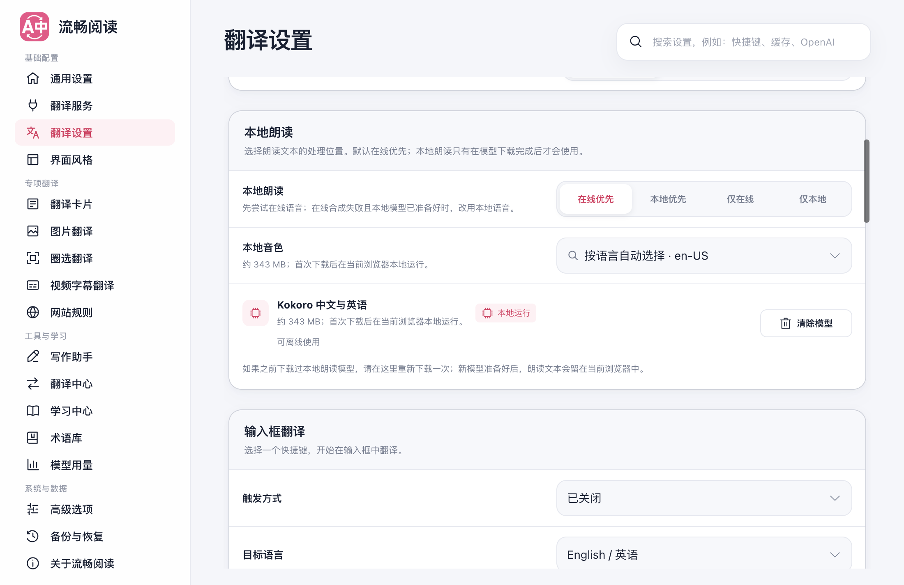

# 本地朗读与 Whisper 的 GPU 优先策略

本地 Kokoro 朗读与 Whisper 音频识别现在优先使用硬件 WebGPU；不可用时使用 CPU（WASM）。已下载的模型仍在浏览器本地运行，GPU 选择不改变在线/本地朗读偏好、音色、源语言或字幕翻译服务。

## 设备选择与失败处理

- 探测高性能硬件适配器，排除软件适配器与无头模拟环境；探测失败或两秒未响应时选择 CPU。
- GPU 初始化或推理失败时，Worker 返回结构化回退标记。外层终止旧 Worker，再新建仅使用 CPU 的 Worker，并且只重试一次。
- GPU 驱动卡住时，外层超时同样能终止 Worker。总预算保持 TTS 120 秒、Whisper 转写 32 秒、Whisper 预热 120 秒，首次尝试最多占一半，CPU 使用剩余时间。
- CPU 再次失败直接返回错误；用户取消、切换音频流和普通业务错误不触发重复请求。旧 Worker 的迟到错误不会终止替代 Worker。
- Whisper 重发时使用独立 PCM 副本，避免 transfer 后使用已分离的 ArrayBuffer。WASM q4 初始化失败时的 q8 回退继续保留。

仅在同一个 Worker 中把 `device` 从 WebGPU 改成 WASM 不够可靠：真实故障注入发现 ONNX 的全局后端状态可能已被 GPU 初始化失败或设备丢失污染，因此回退需要新的 Worker。

## 本地语音模型更新

原 q4f16 模型和对照 FP16 模型在普通中英文文本上均产生过 NaN；该现象在 GPU、CPU、旧 Edge 与新版 Chrome 中复现。音频编码会把 NaN 转为零，过去可能表现为“成功但部分静音”。现在会验证完整音频的非有限采样和全静音，不再把无效波形作为成功返回。

Kokoro 改用同一固定仓库版本的 FP32 模型。GPU 与 CPU 共用这一份模型，扩展安装包未增加模型权重；设置显示首次下载约 343 MB。此前已下载旧模型的用户需要在设置重新下载一次。旧缓存不自动删除，朗读模式与音色保留；用户显式清除模型时，同时清理本模型的新旧缓存，不影响其它模型。

该选择符合 [Kokoro 维护者推荐的默认精度](https://github.com/uzen-zone/kokoro-js/blob/main/README-zh.md)。[模型仓库](https://huggingface.co/onnx-community/Kokoro-82M-v1.1-zh-ONNX/tree/main/onnx)列出了各精度文件；[Transformers.js 官方文档](https://huggingface.co/docs/transformers.js/guides/webgpu)说明了 WebGPU 推理入口。

## 验证范围

最终结果见 [浏览器验证记录](./local-audio-gpu-20260913/browser.json)。脚本为 `scripts/testing/run-local-audio-gpu-test.cjs`，使用临时扩展副本和临时 profile，通过后台 CDP 启动，不操作用户日常浏览器。

测试使用真实生产 Kokoro 与 Whisper Tiny Worker，以及明确标记的 GPU API 故障注入。Whisper 设备丢失场景额外运行原样打包的 Offscreen owner 源码，以验证驱动卡死后外层超时、音频重发和新建 CPU Worker。其余故障场景通过 Worker 协议测试驱动执行重建，并由 owner 单元测试补充验证。没有使用模拟模型输出。

覆盖 GPU、CPU、无 GPU、GPU 初始化失败和设备丢失五种条件；TTS 验证中文与英文的有效波形，Whisper 验证识别文字和时间戳。音频使用受控合成语音，未验证真实网站采集、长视频、Whisper Base 或 Firefox 的真实 GPU 推理。速度结果只是本机样本，不代表所有硬件的加速比例。

Chrome 151 / Apple Metal 的 10 个场景全部通过，验证记录核对了最终生产 Worker 的 SHA-256。Whisper 在同一段 2.667 秒音频上的推理耗时为 GPU 646 ms、CPU 1401 ms；故意销毁 GPU 设备后，外层超时并重建 CPU Worker，约 20.7 秒完成识别。

相关 11 个测试文件共 712 项测试通过，覆盖取消竞态、已转移音频的重发、旧 Worker 迟到错误、CPU 重试上限、模型缓存升级和语言配置错误。新增 GPU 探测模块的语句、分支、函数与行覆盖率均为 100%。类型检查、Chrome/Firefox 构建、manifest 校验、文档构建与测试登记检查通过；未运行完整回归套件。

