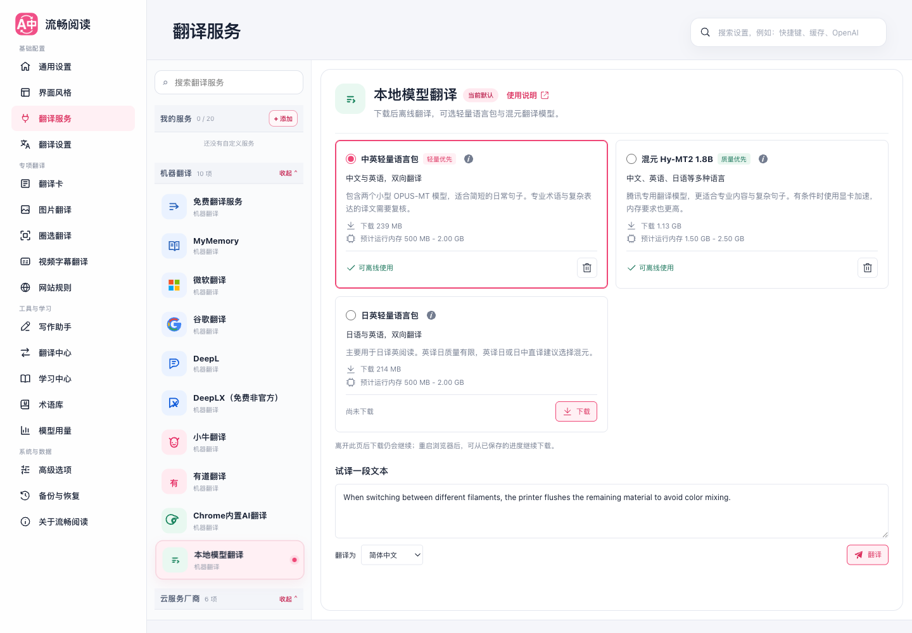

# 本地模型翻译：实现与资源实测

日期：2026-09-12。范围：FluentRead 浏览器扩展中的本地模型下载、管理、翻译与设置 UI。未修改参考仓库。首次实测和干净分支集成验收分开记录，后者见文末。

## 结论

浏览器扩展可以运行开源翻译模型，不必另外安装本地服务器。模型权重按需下载，推理代码随扩展打包。轻量主要意味着下载更小，**不代表内存和 CPU 开销很低**。

本版默认提供中英 OPUS-MT 语言包，另有日英语言包和腾讯混元 Hy-MT2 1.8B。中英包适合普通短句；专业术语、长句仍需复核。日英包的英译日样例明显偏离原意，不能认定质量通过，界面与使用文档已明确提示。混元已完成一次真实下载、断点续传及短句推理验证，不加入日常联网功能测试。

## 模型选择

| 方案 | 实际下载字节 | 运行方式 | 取舍 |
| --- | ---: | --- | --- |
| 中英轻量包 | 238,991,573 | 两个 OPUS-MT q8 ONNX，按方向加载 | 下载较小，中英双向；技术术语不可靠 |
| 日英轻量包 | 213,634,917 | 两个 OPUS-MT q8 ONNX，按方向加载 | 日译英可供阅读；英译日质量有限 |
| Hy-MT2 1.8B Q4_K_M | 1,133,080,448 | wllama 3.6.1，GGUF | 多语言、翻译专用，但文件和运行成本更高 |
| 旧 M2M100 / NLLB | 不再推荐新下载 | 保留已有选择和缓存管理入口 | 避免覆盖用户保存的设置；不再作为新用户默认 |

模型来源：[英中](https://huggingface.co/Xenova/opus-mt-en-zh)、[中英](https://huggingface.co/Xenova/opus-mt-zh-en)、[日英](https://huggingface.co/Xenova/opus-mt-ja-en)、[英日](https://huggingface.co/Xenova/opus-mt-en-jap)、[腾讯官方 GGUF](https://huggingface.co/tencent/Hy-MT2-1.8B-GGUF)。版本和逐文件 SHA-256 固定在 `src/core/config/localTranslationArtifacts.json`，不随远端 main 分支静默变化。

腾讯的 Hy-MT2 系列提供多种参数规模和 1.25-bit 极小版本。但小于 500 MB 的特殊量化不等于可直接使用当前浏览器运行时。这里选择已经真实跑通的官方 Q4_K_M，未采用未经验证的特殊量化。厂商介绍的 33 种语言与综合评测结果属于厂商证据，本次只对选定短句做了本机验证，不能据此宣称所有语言达到同等质量。[腾讯模型说明](https://huggingface.co/tencent/Hy-MT2-1.8B-GGUF)

模型卡片的信息入口保留来源与许可链接。推理运行时的 MIT 授权文件随扩展打包；模型许可分别以对应仓库为准。

## 实测方法

- Apple M1 Pro，32 GiB 内存，10 个逻辑核心，macOS。
- Google Chrome for Testing 151.0.7922.34，加载生产构建；独立临时 profile，无日常浏览器页面或凭据。
- 用户已授权临时前台测试；`launchMode=playwright-headed`，`focusPolicy=foreground-authorized`，窗口居中于第二块屏幕，1440 × 1000。
- 模型通过扩展实际下载并校验；不是模拟模型或云端接口。中英短句曾在 Offscreen 网络禁用时成功翻译，之后已恢复测试网络。
- 每约 250 ms 通过 CDP 获取测试浏览器进程，再读取各进程 RSS。下面的“基线/峰值”是**整个测试浏览器的进程 RSS 之和**，会重复计算共享页，包含设置页和网页，不能当作模型精确物理内存、显存或额外内存。
- CPU 为采样起止均存在的进程 CPU 时间差，可能漏掉期间退出/新增的进程。100% 表示约占用一个逻辑核心，不是整机 100%；10 核机器中 276% 约等于 2.76 核的平均忙碌程度。
- 时间包含必要的模型载入与消息开销。每项为单次样例，不是统计基准，不可外推为所有设备的性能承诺。Hunyuan 配置优先尝试 WebGPU，但本次证据未记录最终后端选择，不能断言 GPU 加速已被独立验证。

| 样例 | 总耗时 | 浏览器 RSS 基线 | 浏览器 RSS 峰值 | 采样平均 CPU |
| --- | ---: | ---: | ---: | ---: |
| 中英包，英译中短句，冷加载 | 2.46 秒 | 1.00 GB | 2.13 GB | 276% |
| 中英包，Bambu 整段试译 | 2.48 秒 | 1.09 GB | 2.93 GB | 202% |
| 中英包，中译英短句 | 1.15 秒 | 1.17 GB | 2.06 GB | 174% |
| 日英包，日译英短句 | 1.39 秒 | 1.00 GB | 1.57 GB | 143% |
| 日英包，英译日短句，质量不通过 | 1.54 秒 | 0.78 GB | 1.48 GB | 133% |
| 混元，一次性英译中短句 | 5.92 秒 | 1.16 GB | 2.34 GB | 106% |

原始采样：[中英冷加载](./local-translation-20260912/opus-en-zh-cold.json)、[Bambu 整段](./local-translation-20260912/opus-bambu-paragraph.json)、[中译英](./local-translation-20260912/opus-zh-en.json)、[日译英](./local-translation-20260912/opus-ja-en.json)、[英译日](./local-translation-20260912/opus-en-ja.json)、[混元](./local-translation-20260912/hunyuan-once.json)。GB 按十进制计算。

因此 UI 不再显示过于乐观的 300–650 MB，而是给轻量语言包显示 500 MB–2 GB 的粗估，并注明实际依赖文本与设备。不要同时打开很多使用模型的扩展页面。持续空闲 30 秒后会终止模型 Worker，实测观察到试译后的 Worker 数量由 1 变为 0；这证明 Worker 生命周期结束，不保证操作系统立即回收全部 RSS。[释放记录](./local-translation-20260912/idle-release.json)

首次实测工作树的完整扩展未压缩构建约 93.74 MB，包含既有 OCR、PDF、视频及另一任务的本地语音资产，不能全部归因于翻译功能。最终干净集成分支排除了本地语音改动，Chrome 与 Firefox 构建均约 66 MB。混元运行时的 WASM 约 8.1 MiB，静态 Worker 约 152 KiB；权重不内嵌安装包。所有推荐模型都下载时，模型数据约 1.59 GB，另需存储元数据和下载余量。

## 下载与恢复

下载由扩展自己的 Offscreen 管理器持有，设置页只订阅持久化快照。导航、关闭设置页不会取消任务；浏览器重启后可以继续已保存进度。

任务区分排队、下载、校验、暂停、可用、失败和删除。4 MiB 分块持久化，按准确的字节位置发送 Range；服务器不接受范围时受控重下该文件。HF 原站和镜像自动切换，不让用户维护源列表；固定哈希校验避免不同源内容混用。头部与无数据等待都有超时。

本次测试窗口在模拟断网后，混元曾停在 99%，用户点击重试仍失败。这里的直接原因是测试网络条件尚未恢复，不应冒称为已确认的生产下载器缺陷。恢复网络后请求返回 HTTP 206：`bytes 1128267776-1133080447/1133080448`，只补了 4,812,672 字节，随后通过校验并进入可用状态，没有重新下载 1.13 GB。

删除需要二次确认。实测取消后日英包仍为 ready，确认后只有日英包变为 idle，中英与混元仍为 ready。[删除记录](./local-translation-20260912/delete-result.json)

## 翻译失败修复

用户报告的 Bambu 段落含有独立链接文字 `Reduce Waste during Filament Change`。短链接单独被语言检测器判断为荷兰语，但整段是英语；中英模型因此拒绝此槽，连带段落失败。

本地模型现在逐槽翻译，以所在段落的纯文本辅助 auto 语言检测，不向模型发送结构标记。检测样本只服务于本地推理，不替换翻译正文、不传给云端 provider；显式源语言保持最高优先级。检测上下文同时纳入 auto 请求的缓存和 pending 身份。

错误展示不再因为信息里含有“模型”或 `model` 就归类为配置错误。语言方向不支持、推理超时、输出重复/不完整等提示保留真实原因。

真实网页验证了 Bambu、example.com、GitHub 文档三个段落的 `[1, 0, 1]` 翻译切换；相邻段落均为 `[0, 0, 0]`，恢复后的原始 DOM 一致，URL 未跳转，无重复译文或错误按钮。完整页面的所有段落和所有语言组合没有在本次穷举。

证据：[Bambu](./local-translation-20260912/bambu-toggle.json)、[example.com](./local-translation-20260912/example-toggle.json)、[GitHub](./local-translation-20260912/github-toggle.json)。这些证明交互与输出链路成功，不代表译文质量全面通过。样例中 OPUS 仍把 hotend、filament 等术语误译；英译日还出现了明显无关内容。

## 界面

按用户最后确认恢复双列模型卡片，只压缩说明、间距和空白，不改为列表。删除了重复介绍标题和冗余“使用此模型”按钮，单选圆点负责选择；信息按钮展开资源说明与许可链接。下载、暂停、继续、重试、删除确认和试译保留。

卡片容器不足 620 px 时改为单列。1440、820、390 三档检查中，卡片没有横向溢出；也检查了深色模式和信息展开。桌面普通卡片约 215–235 px 高，内容变多时自然增高，不裁切错误提示。

[窄窗口](./local-translation-20260912/cards-820.png) · [手机宽度](./local-translation-20260912/cards-390.png) · [深色模式](./local-translation-20260912/cards-dark.png) · [删除确认](./local-translation-20260912/delete-confirm.png)

## 工程验证与边界

- 12 个相关测试文件、500 项测试通过，覆盖语言上下文传递、显式语言优先级、缓存隔离、下载校验和状态管理等。
- 下载存储、下载管理器、推理纯函数、浏览器能力、七语言文案和错误映射的专项覆盖率，statements / branches / functions / lines 均为 100%，78 项检查通过。此数字不是整个新增功能的全局覆盖率声明。
- TypeScript/Vue 类型检查、测试审计通过。Chrome、Firefox、userscript 构建和 userscript verifier 通过；Firefox 这里只验证构建，不宣称真实混元运行测试通过。
- 中英文文档构建通过，服务目录视图模型的 17 项检查通过。
- 现有全量 UI 脚本执行过，但在寻找旧 popup 标题“让阅读自然地流动”处超时，未完成全量 UI 套件。本文提供的是本功能的实际截图和交互测试，不以它冒充完整套件通过。
- 验收末尾在构建文件更新期间重载临时扩展后，额外的负向浏览器测试停在创建页面，未执行成功；正常关闭也没有响应，最终仅结束了已核对的临时浏览器与脚本。该尝试不计为通过，商店版本更新流程仍未覆盖。此前已保存的模型和页面验证不依赖该尝试。
- 架构归属检查仍被继承工作树中的 9 个本地 TTS 模块缺少覆盖率归属阻断；未修改或豁免这些无关模块。相关测试合计 508 通过、1 个上述架构检查失败。
- 没有将真实模型下载加入默认 functional、CI 或定期任务。浏览器脚本是显式调用的手工验收工具；未来日常回归不重复下载混元。
- 模型在专属 Worker 中串行运行，空闲释放；段落分块、重复输出防护和执行超时限制资源失控。OPUS 单线程推理仍可能在载入时引发多进程 CPU 峰值。
- MV3 不允许把远程代码或 Blob Worker 当作无限制执行入口。wllama Worker 以固定依赖的 AST 构建为扩展内静态资产，失败时不降级到远程脚本；仅下载模型数据。[Chrome CSP](https://developer.chrome.com/docs/extensions/reference/manifest/content-security-policy) · [wllama](https://github.com/ngxson/wllama)

使用说明已同步到中英文翻译服务文档。测试 profile 和模型缓存仅属于本次隔离测试，未修改日常浏览器配置。未进行商店发布或审核。

## 干净分支集成验收

合并请求以 `main` 的 `d13a641c` 为基线，仅提取本地翻译、错误原因和相关文档测试改动。原工作树中的本地 TTS、站点适配及其他未提交工作没有进入本次提交；最新主线的服务目录、多密钥设置和其他功能保持。

- 全量确定性测试首次为 332 个文件、6,502 项，只有一条依赖 Vue 属性顺序的源码断言失败；保持原属性顺序后，该文件 29 项复测通过。随后为本地消息路由和服务可用性补充了 17 项纯单元用例，没有增加联网模型测试。
- 最终覆盖率运行的 270 个文件、5,336 项全部通过。全局 statements / functions / lines 为 100%，branches 为 99.99%。唯一缺口是未修改的 `core/translation/layout.ts` 和 `full-page-translation/content/liveTextRender.ts` 各一个分支；在独立、干净的 `d13a641c` 上重跑完整覆盖率得到相同缺口（264 文件、5,256 项通过）。没有调低门槛或屏蔽失败。
- 本次纳入 strict coverage 的模型文件存储、下载管理、推理纯函数、浏览器支持判断、文案、消息路由、翻译能力、上下文传递和错误映射目标均为四项 100%。浏览器绑定的其余适配层仍采用专项契约和构建验证，不宣称整个新功能每一行均有 100% 覆盖率。
- 测试审计通过：332 文件、4,336 个静态用例声明；TypeScript/Vue 检查通过。Chrome、Firefox、userscript 生产构建通过，userscript verifier 为 4,817,992 字节。中英文文档构建通过。
- 用最终 Chrome 生产产物在新的临时 profile 中检查了模型卡片、信息展开、快速刷新后的模型选择保存，以及默认服务不被编辑操作改变。1440 px 为双列，820 / 390 px 为单列，没有横向溢出；深色模式已截图，页面未处理错误为 0。窗口位于第二块屏幕，`launchMode=playwright-headed`，`focusPolicy=foreground-authorized`。
- 合并验收没有下载或运行任何模型；真实推理与资源数据仍来自前文首次实测，不与本轮 UI 检查混为一谈。旧 Playwright 1.47.2 的首次窗口初始化失败后已停止并清理，仅在改用当前捆绑 1.62.1 后执行成功。

集成 UI 记录：[原始断言](./local-translation-20260912/integration-ui.json)、[桌面](./local-translation-20260912/integration-1440.png)、[820 px](./local-translation-20260912/integration-820.png)、[390 px](./local-translation-20260912/integration-390.png)、[深色](./local-translation-20260912/integration-dark.png)。本轮只执行专项 UI 冒烟，前述旧全量 UI 脚本的失败边界保持不变。

提交前主线新增了 PR #578 的段落边界修复，随后已将 `40f7b060` 合入本分支。最新集成状态的完整确定性测试为 **332 个文件、6,531 项全部通过**；上述资源实测、UI 截图和覆盖率基线比较仍分别属于前述验收阶段，不改写其历史结果。
