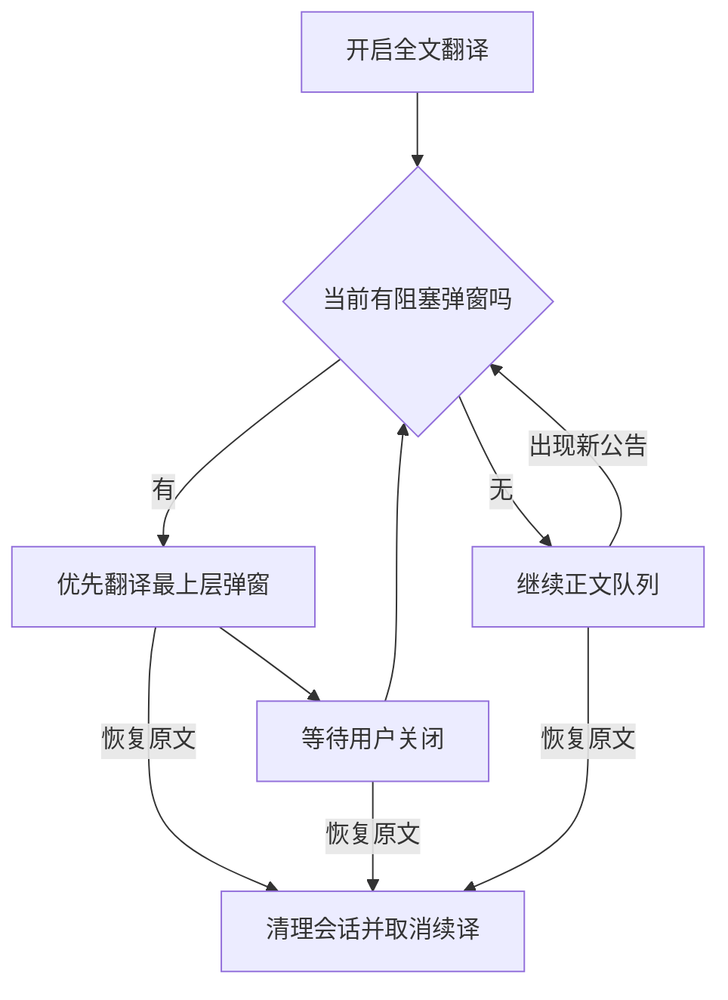
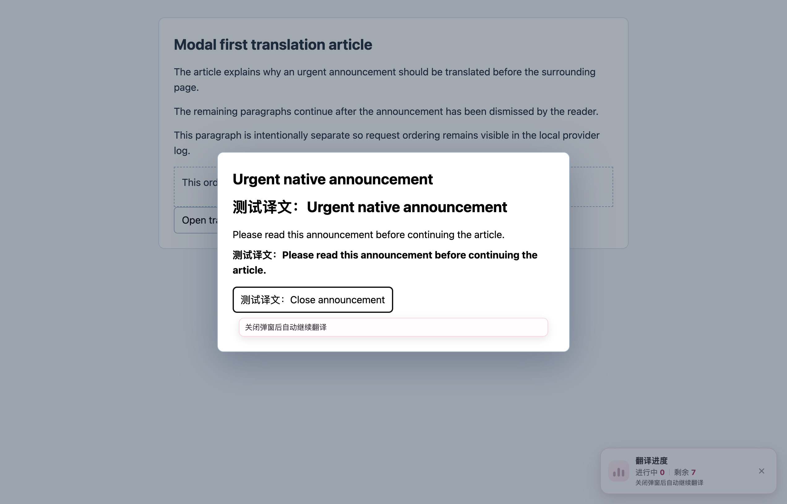
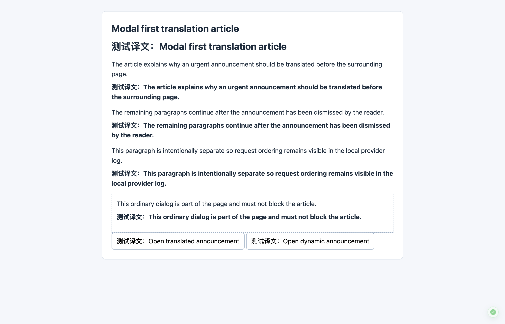

# 全文翻译：公告优先与关闭后续译

启动全文翻译时先处理当前阻塞阅读的弹窗，用户关闭后自动继续同一次正文翻译。运行中出现新公告时，暂停尚未完成的正文请求，保留已经显示的译文。恢复原文会结束整个会话并取消自动续译意图。

## 用户体验

- 不增加配置步骤，也不自动关闭、确认公告或改变页面焦点。
- 等待期间显示“关闭弹窗后自动继续翻译”，停止持续加载动画，不用完成勾表示整页结束。
- 原生 `showModal()` 的 top layer 内增加轻量提示，避免提示被背景遮罩盖住；提示在关闭按钮之后自然排版，保留关闭按钮和事件。
- 提示沿用现有进度开关。隐藏进度面板只隐藏说明；恢复原文才取消翻译。禁用进度功能时也清理原生公告内提示。
- 公告翻译失败仍可原地重试或直接关闭；正文不会因为公告失败永久停住。
- 普通非模态面板、已隐藏的弹窗和显式非模态 ARIA 对话框不阻塞正文。

## 实现与边界

`modalPriority.ts` 只读取页面，支持原生 `dialog:modal`、ARIA dialog/alertdialog，以及具有定位、遮罩或滚动锁等阻塞证据的常见组件弹窗。它检查祖先隐藏状态和真实布局，支持调用方已发现的开放 ShadowRoot，按 top layer、嵌套关系和命中测试等选择当前弹窗。普通提示条不因名称或高 z-index 就暂停整页。

`modalSession.ts` 负责切换范围、取消旧 loading generation 并保留正文候选。`runtime.ts` 仍是唯一全文会话：沿用候选规则、服务配置、并发限制、缓存、恢复和请求所有权。弹窗关闭后的新 generation 可以复用同源结果，但旧请求不能在公告仍打开时回写正文。

正文仍遵守用户保存的视口/整页模式和页面识别范围。没有可识别模态语义或阻塞证据的任意自绘组件可能需要站点适配；关闭的 ShadowRoot、浏览器自身的 JavaScript alert 或权限提示不属于页面 DOM 翻译范围。

## 专项 case 与实测

- `tests/fixtures/modal-first-translation.html`：原生公告、ARIA 公告、动态公告与普通面板。
- `scripts/testing/run-modal-first-translation-test.cjs`：加载生产扩展，通过真实全文翻译快捷键检查公告请求优先、关闭续译、恢复重译、逐段唯一译文和提示清理。
- `tests/fullPageVisibilityScheduling.test.ts`：“公告优先 case”与相关回归覆盖视口/整页、在途请求、关闭/重开、移除、嵌套、失败、恢复取消以及已有正文保持稳定。原始调度实现无法通过新增的公告优先 case。
- `tests/fullPageModalPriority.test.ts`、`tests/modalProgressHint.test.ts` 与 `tests/fullPageTranslationProgress.test.ts`：检测、提示所有权与进度状态。

生产 Edge 的 4 组浏览器 case 全部通过，共记录 37 次本地确定性请求，没有页面运行时错误或意外网络请求。测试使用临时 profile；`launchMode=macos-background-cdp`、`focusPolicy=launchservices-no-foreground`、`windowPlacement.mode=background-visible-no-focus`，第二屏正常尺寸窗口，`browserFrontmost=false`。

供应商响应为本地 mock：截图中的“测试译文”用于证明请求、渲染与续译行为，不代表真实翻译服务的语言质量。Firefox 和 Userscript 的证据为构建验证，不是这次真实浏览器实测。

## 自动化验证

- 全量测试：282 个测试文件、5,744 条用例通过。
- 严格覆盖率：229 个测试文件、4,694 条用例通过；配置内模块的 statements、branches、functions、lines 四项均为 100%，包含新增弹窗检测、会话切换和原生弹窗提示模块。
- 架构检查：27 个测试文件、900 条用例通过。类型检查、测试审计、Chrome/Firefox/Userscript 构建、产物校验与文档构建通过。
- 最初高负载并发运行出现无关词书、缓存和文档用例的 5 秒超时；同组 90 条用例在原始基线和任务分支上使用原有超时均通过。最终全量与覆盖率检查使用 4 个 worker、命令行 30 秒超时；没有改动仓库的测试超时配置或断言。

本次按 FluentRead 现有架构独立实现，没有借用或修改参考仓库。

[浏览器完整报告](./modal-first-translation-20260912/report.json)

公告打开时，背景文章保持原文，公告内提示等待关闭：

关闭公告后，同一会话自动继续正文：

