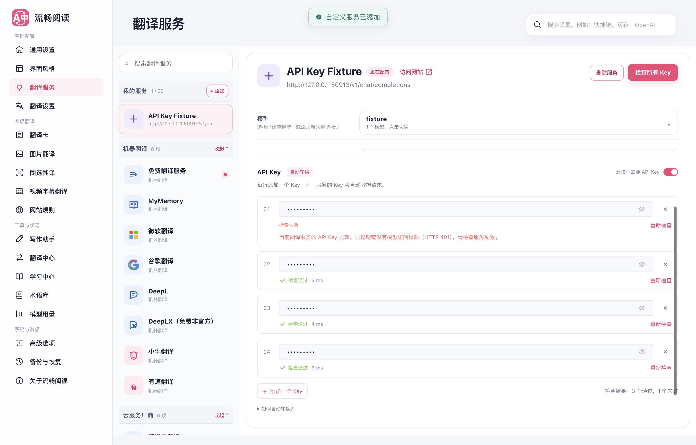
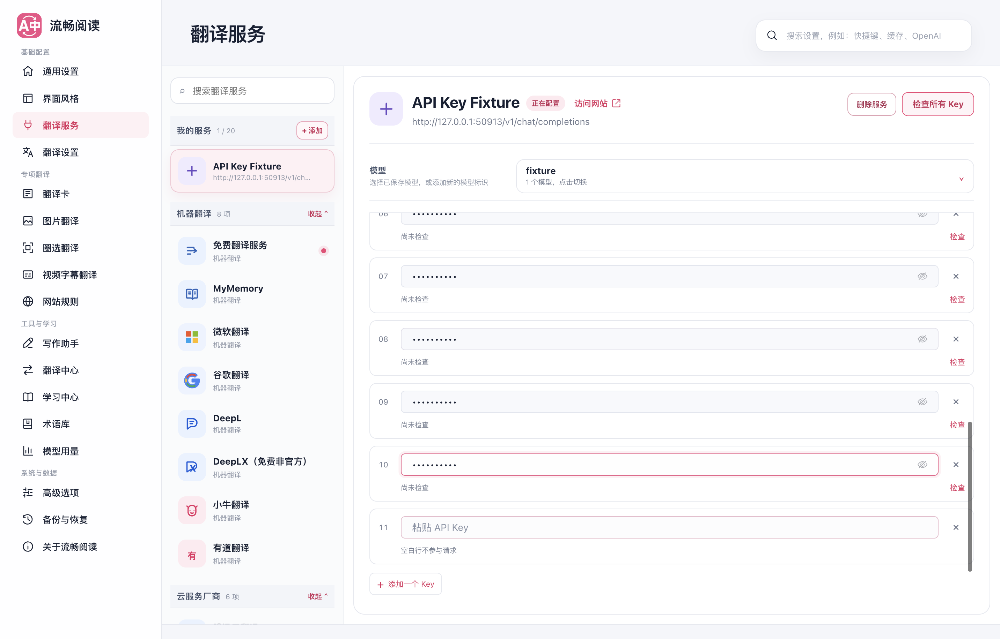
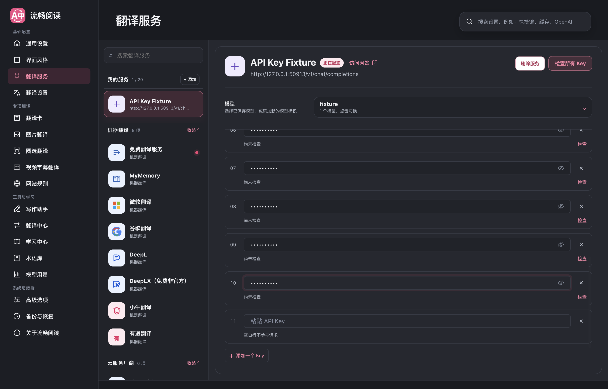
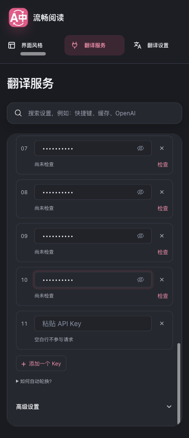

# 多 API Key 自动轮换与逐项检查

> 后续已重整密钥管理界面；最新交互与截图见 [多 Key 界面重整](../multi-key-ui-20260912/README.md)。本页保留初版机制及其回归证据。

对应 [Issue #161](https://github.com/FluentRead/FluentRead/issues/161) 和 [Issue #171](https://github.com/FluentRead/FluentRead/issues/171)。同一翻译服务可以逐行添加多个 Key；翻译时自动分担请求并避开失败的 Key，检查连接时则明确检查每一行。

本报告的运行时代码基于 `6499537e5138e640ecd263a778bff9574e595447`，已整合主分支 `64cc5e1c10b331bd0adc371e1aaae7308d148db9`。随后只补充浏览器测试场景与本报告，不修改运行时代码。

## 用户流程

1. 在服务配置中填写第一行 Key，点击「添加一个 Key」继续添加。现有空行会直接获得焦点，不堆积空白输入框；不要求使用分隔符。
2. Key 默认隐藏。每行可以独立删除、显示或隐藏、检查或重新检查。空行不参与请求，重复项明确提示并跳过。
3. 点击「检查所有 Key」后依次检测，逐行显示等待、检查中、成功勾及耗时，或具体失败原因。某一行失败不会借用另一行来显示成功。
4. 可停止后续检查，已完成结果保留；当前已发送的请求可能继续完成。修改 Key、服务地址、模型等配置后，旧结果失效，迟到的响应不会重新点亮旧的成功勾。
5. 日常翻译自动选择 Key，无需用户维护优先级。成对使用 Access Key ID / Secret 的服务继续保留一组完整凭据；只需一个密钥的云服务支持多行 Key。

每行 Key 共用当前服务的地址、模型、区域及自定义请求头等设置。不同服务或不同自定义服务之间不共享 Key。原有单 Key 配置自动保留为第一项；完整备份保留凭据，公开配置和历史记录不包含 Key 列表。

## 轮换规则

| 情况 | 后续行为 |
| --- | --- |
| 新增 Key / 初始状态 | 权重均为 4，使用平滑加权轮询分担请求 |
| 网络、超时、服务端临时故障 | 失败 Key 权重减半并向下取整，本次请求尝试其他 Key |
| 鉴权失败、额度不足、限流 | 失败 Key 权重归零，暂时跳过，本次请求尝试其他 Key |
| 成功请求 | 权重增加 1，最高恢复到初始值 |
| 恢复窗口到期 | 默认距最近失败 1 分钟后恢复初始权重；用户可在高级请求限制中调整为 1–60 分钟；服务端提供重试时间时遵循该时间 |
| 单独检查成功 | 将该 Key 恢复为初始权重 |
| 取消或一般模型、参数配置错误 | 不扣减 Key 权重；不会靠轮换反复尝试相同的配置问题 |
| 全部 Key 暂时不可用 | 返回失败及重试信息，不无限循环 |

一次翻译中每个 Key 最多尝试一次，所有尝试共用总超时预算，并继续遵守现有并发与速率限制。连接检查也经过相同调度限制。写作等流式能力在流建立前可以切换 Key；已经开始输出后不会重放请求，避免重复内容。

健康权重保存在后台内存中，后台进程重启后重新从等权开始。成功勾仅代表当前配置的一次检查成功；检查会产生小额测试请求，不代表持续可用或免费。

## 页面证据

生产 Chrome MV3 产物加载到隔离 Edge 临时 profile；本地 HTTP fixture 对 A 返回 401，对其他合成 Key 返回成功。下图展示 A 失败、B/C/D 分别成功的结果。



十个 Key 与末尾空行仍可继续添加；窄屏下模型和连接配置可连续滚动查看，没有横向溢出。







## 验证结果

| 验证 | 结果 |
| --- | --- |
| 全量 Vitest | 305 个文件，6,143 个用例通过 |
| 严格覆盖率套件 | 248 个文件，5,017 个用例通过；统计范围内 statements / branches / functions / lines 均为 100% |
| 测试审计 | 305 个文件归类有效，未发现重复、遗漏、违规跳过或覆盖率忽略 |
| TypeScript / Vue 类型检查 | 通过 |
| Chrome / Firefox 构建与 manifest verifier | 通过 |
| Userscript 构建与 verifier | 通过 |
| 文档构建 | 通过 |
| 生产扩展多 Key 浏览器专项 | 13 / 13 通过，控制台未捕获页面错误 |

浏览器专项覆盖：空行复用、重复项跳过、实际翻译消息经过 broker 后从失败的 A 切换到 B/C、逐项检查不代偿、单项重测、删除第一项、停止后续检查、检查中编辑、十行 Key、深色窄屏、重新打开后持久化、成对云凭据保持完整，以及单密钥云服务的多行编辑。两个云服务场景仅验证配置界面，没有向外部供应商发送请求。

原始专项报告整理为 [browser-report.json](./browser-report.json)，命令结果摘录保存在 [validation.txt](./validation.txt)。自动化入口为 `scripts/testing/run-api-keys-ui-test.cjs`。启动模式为 `macos-background-cdp`，焦点策略为 `launchservices-no-foreground`，窗口位于第二块屏幕，模式为 `background-visible-no-focus`；报告记录 `browserFrontmost=false`。

运行命令：

```sh
pnpm exec vitest run --maxWorkers=2 --minWorkers=1 --testTimeout=20000
pnpm exec vitest run --config vitest.coverage.config.ts --maxWorkers=2 --minWorkers=1 --testTimeout=20000 --coverage.reportsDirectory=/private/tmp/multikey-delivery-coverage
pnpm compile
pnpm build
pnpm build:firefox
pnpm verify:extension-manifests
pnpm build:userscript
node scripts/verify-userscript-build.mjs
pnpm docs:build
pnpm test:audit
```

## 证据范围与限制

- 浏览器专项验证的是实际生产扩展、消息链、HTTP 传输和 UI，服务响应来自本地模拟端点，未验证任何真实付费供应商的账号、额度或持续可用性。
- Firefox 与 Userscript 完成构建验证，本次没有运行对应真实浏览器 UI 或用户脚本端到端测试。
- 已尝试原有 full UI 技能脚本，但其在 `run-ui-test.cjs:533` 等待旧 popup 标题「让阅读自然地流动 / 翻译功能已暂停」时超时；当前标题已改变。主分支此前已有相同的 [基线失败记录](../quick-settings-20260912/full-ui-baseline.txt)。该套件未计为通过；本次命令输出未重定向保存，所指定的证据目录为空。
- 本次实现未复制或修改参考项目 `read-frog`、`kiss-translator`，未增加跨仓库依赖。
