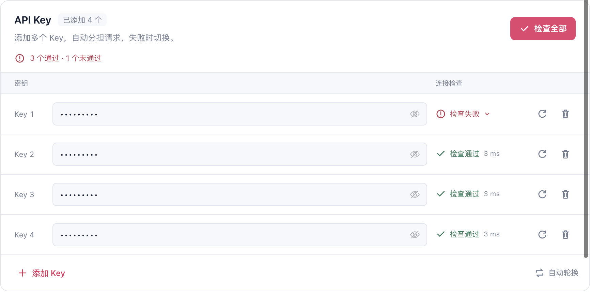
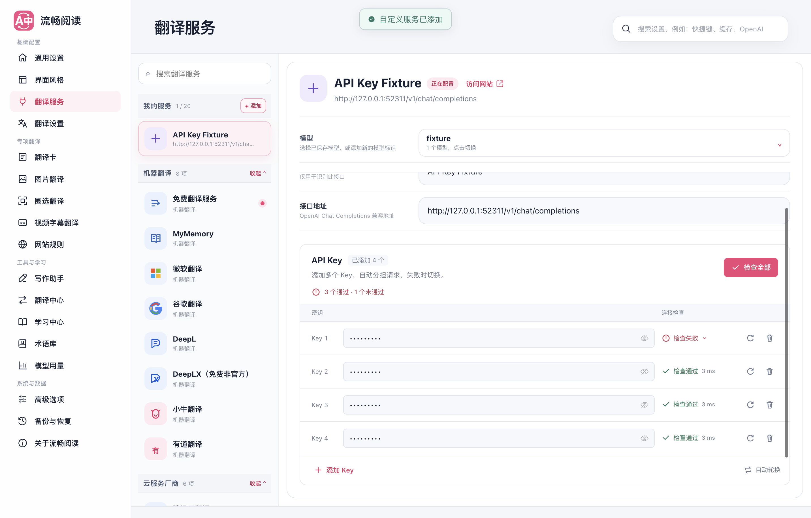
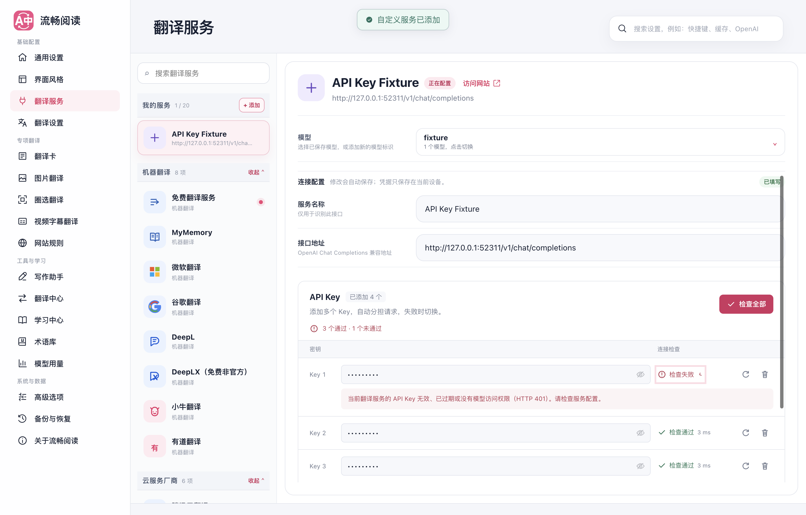
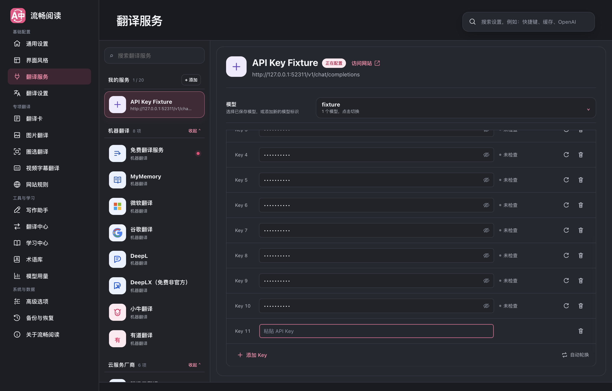
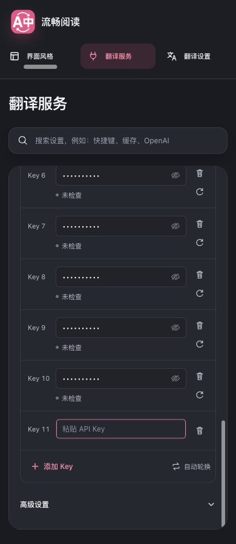

# 多 Key 界面重整

本次针对 PR #560 初版的操作层级与可读性进行调整，自动轮换、凭据保存和后台请求策略沿用原实现。

## 界面与操作

- **操作就近。**「检查全部」放在 Key 列表上方，与数量、进度和汇总处于同一区域；检测时原按钮变为「停止后续检查」。服务头部不再重复放置检查操作。
- **结果对齐。** 将每个 Key 的独立大卡片改为紧凑列表，密钥、连接状态和行末操作按列对齐。单项重测使用次要图标按钮，并有可访问名称和悬停提示。
- **失败可展开。** 失败状态可以点击或使用 Enter 展开原因；默认列表保持一致的行高，不铺满长错误消息。
- **低频设置收起。** 免 Key 接口开关与删除服务放入高级设置。原有开关状态继续保存；不填写 Key 时，只在接口允许免 Key 请求的情况下开放检查。
- **按区域宽度响应。** Key 区域较窄时输入、状态分行排列，适应侧边栏占用空间的 820px 窗口和 390px 手机宽度。

连接状态仍表示一次实际检查的结果。界面不把「已填写」解释为「连接可用」，也不展示未经获取的实时健康权重。单项重测只显示当前 Key 的进度，不套用全量检查的分母。

## 页面截图

## 验证

相关的配置、检查身份、Key 列表状态、界面架构与多语言测试共 83 项通过。随后合入主分支 `0008a791`，解决测试清单冲突并清理重复归类；合并后的 `b6813e5b` 完成全量回归，314 个文件、6,273 个用例通过。类型检查、测试审计、Chrome / Firefox 构建、manifest 校验、Userscript 构建及 verifier 均通过，文档构建通过。

整合后另补充了 UTF-16BE、解码回退及混合文字判断的边界测试，两个相关测试文件共 84 项通过。严格覆盖率套件的用例全部通过，语句、行与函数覆盖率均为 100%，分支为 99.99%，**未达到全局 100% 门禁**。唯一剩余项是主分支 `src/core/translation/text.ts:306` 的 `match(...) ?? []` 防御回退；调用方已经确认字符串包含假名或谚文，该回退不会经正常入口触发。该生产文件与主分支一致，本次没有通过改写它或降低阈值消除数字差距，具体结果见 [coverage-baseline.txt](./coverage-baseline.txt)。

浏览器验证使用生产 Chrome MV3 扩展与隔离 Edge 临时 profile，17 项专项检查通过，未捕获页面错误，HTTP 请求仅发送到本地模拟服务。运行模式为 `macos-background-cdp`、焦点策略为 `launchservices-no-foreground`，窗口在第二块屏幕以 `background-visible-no-focus` 模式运行，`browserFrontmost=false`；详细交互结果及焦点状态见 [browser-report.json](./browser-report.json)，命令输出摘要见 [validation.txt](./validation.txt)。

原始轮换实现的完整回归记录见 [多 Key 机制报告](../multi-key-rotation-20260912/README.md)。本次没有重新执行真实供应商调用或 Firefox UI 验证。已再次尝试 full UI 技能脚本，其仍在旧 popup 标题选择器处超时，日志保存在 [full-ui-baseline.txt](./full-ui-baseline.txt)，不计入通过结果。

附加截图：[首次填写](./api-keys-empty-initial.png)、[十个 Key](./api-keys-ten.png)、[820px 窗口](./api-keys-820.png)。本次未复制或修改参考项目。
