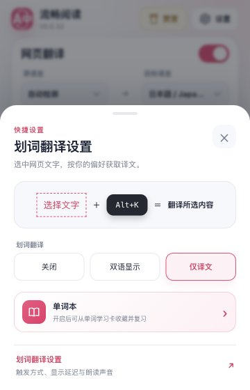
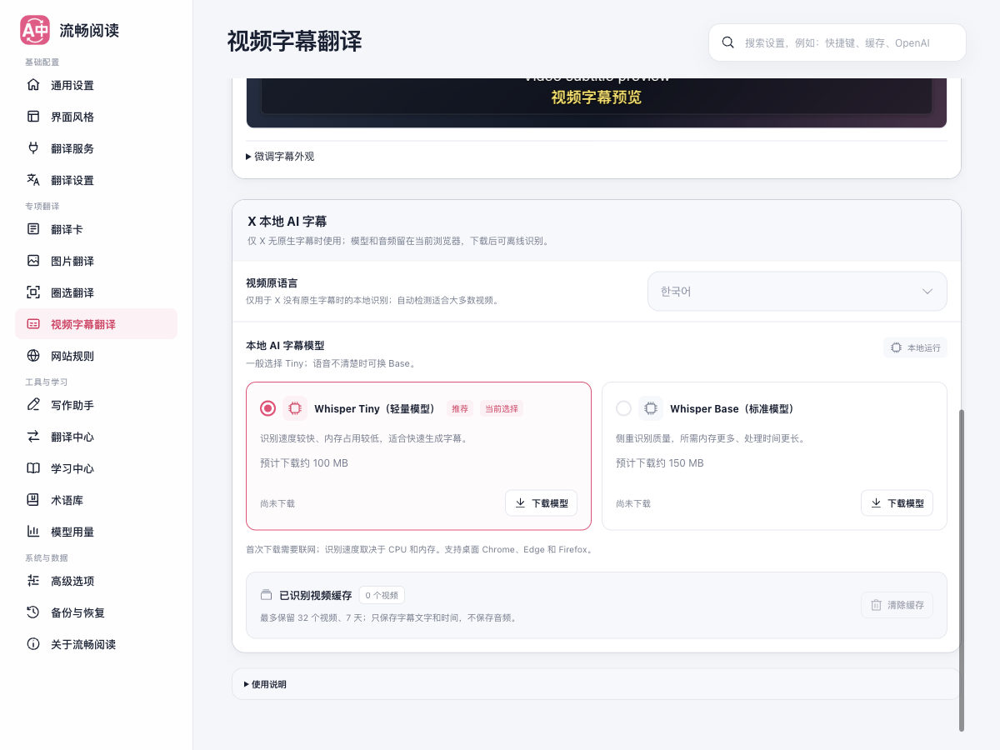

# 快捷菜单精简

本轮将菜单栏中的快捷面板收敛为开关、显示方式和当前用法。模型、快捷键编辑、朗读音色、样式等长期偏好放在完整设置，面板底部直接进入对应分类。更少的选择用于完成当前任务，已有配置继续沿用。

## 交互变化

| 面板 | 快捷操作 | 完整设置中的偏好 |
| --- | --- | --- |
| 视频字幕 | 开关；双语、仅译文、仅原文；已隐藏时先提供显示字幕入口 | 独立翻译服务、源语言、本地模型、字号和字幕外观 |
| 划词翻译 | 关闭、双语、仅译文一次选择；当前触发方式示意；单词本入口 | 触发方式、自定义快捷键、延迟、朗读音色及回退顺序 |
| 鼠标悬停 | 关闭默认入口；当前快捷键和已有独立方案摘要 | 选择、重新启用快捷键，以及独立方案编辑 |
| 译文显示 | 双语、仅译文 | 译文样式、界面主题及其他阅读偏好 |
| 图片与圈选 | 保留启用操作和用法 | 底部链接明确说明可调整的识别与翻译偏好 |

视频菜单不再把“开关已开启”描述成“正在显示中文译文”。字幕的源语言和本地模型仅归属于 X 本地识别；播放器中生成 AI 字幕的提示明确限定适用场景。隐藏字幕后修改显示方式不会立即出现字幕，因此快捷面板先提供显式恢复入口，只修改可见性，保留用户的模式选择。

划词原有启用开关会在重新开启时固定选择双语。本轮把开关与模式合为三选一，用户直接选择需要的状态，避免隐式切换。禁用划词后，触发方式、延迟及音色仍保留；完整设置中重新启用后可以编辑。

悬停关闭后不再固定改回 Control：关闭状态提供“选择快捷键”，进入完整设置明确选择。已有自定义组合和独立方案保留，不用一个开关掩盖快捷键替换。

## 完整设置

本地模型直接点选 Tiny / Base 卡片，去掉与卡片重复的下拉框；Tiny 标为推荐，并继续展示下载大小、资源差异及已下载状态。字幕外观保留皮肤预览，低频的颜色、行距、偏移等收进“微调字幕外观”。

设置页整体替换配置草稿时，模型卡片与字幕外观现在跟随最新对象，避免继续编辑旧草稿或让禁用状态滞后。原先只能在快捷面板中编辑的朗读音色已经迁入划词完整设置；本轮不修改配置格式、翻译服务、字幕识别或存储协议，也未读取或修改参考项目。

## 验证

在 2026-09-12 的生产构建上完成以下验证：

| 验证层 | 结果 |
| --- | --- |
| 测试审计 | 287 个文件唯一归类，无审计错误 |
| 架构 / 单元 / 功能 / 回归 | 分别 907 / 3203 / 1296 / 429 项通过，共 5835 项 |
| 国际化 | 43 项通过；七种语言补齐新增文案 |
| 最后组件修复 | Popup、字幕外观、设置架构和国际化相关 96 项再次通过 |
| 发布构建 | 类型检查、Chrome MV3、Firefox MV2、Userscript 通过 |
| 产物边界 | 双浏览器 manifest 和 Userscript verifier 通过 |
| 真实浏览器 | 生产 Chrome 扩展在 Edge 中的快捷设置专项通过，控制台错误为 0 |

默认并行执行时，资源竞争使缓存、阅读面板和词书生命周期的既有用例触发 5 秒超时，另有一次全文可见性断言受并行时序影响；相关文件单独运行均通过。随后以 2 个 worker 依次运行完整单元、功能和回归分组，181 / 60 / 19 个文件、3203 / 1296 / 429 项全部通过，没有修改用例或提高超时。

浏览器验证通过真实扩展后台写入专用测试偏好，覆盖六个面板和六条设置跳转、划词三种状态、视频三种模式、字幕隐藏后恢复、非默认偏好保留、修改后立即关闭、重开、跨页同步和连续写入。悬停另外验证关闭后自定义组合仍在、进入设置不自动启用 Control，以及明确重新选择自定义快捷键后恢复原组合。完整设置验证 17 个导航分类、朗读音色编辑与重开保存、模型卡片整卡选择、视频关闭后的禁用，以及配置草稿替换后的字幕皮肤和字号预览/保存。点击模型卡片没有触发下载。

测试使用独立临时 Edge profile，在第二块屏幕的正常尺寸窗口可见运行，没有抢前台：`background-visible-no-focus`，窗口位置 `(132, -1040)`、尺寸 `1440 × 1000`，启动前后的前台应用一致。Popup 按 `360 × 560` 视口验证；另启用可选的“译文显示”卡片后，主面板实际为 `360 × 528`，没有横向溢出。六个抽屉均无需内部滚动；设置页在 390px 宽度下没有横向溢出。

完整的外部 UI skill 套件已经尝试运行，但停在旧标题定位器：它等待“让阅读自然地流动”，而当前 `main` 的 Popup 标题已是“网页翻译”。这是测试脚本与当前界面不一致，不能记录为全量 UI 通过。专项使用实际 DOM 与配置状态完成上述验证。参见[原始专项报告](./browser-report.json)与[旧套件失败记录](./full-ui-baseline.txt)。

本轮没有调用真实外部翻译服务、下载本地模型或验证播放器识别质量；Firefox 和 Userscript 的证据限于构建与产物检查。文档构建和 `git diff --check` 也已通过。

## 界面截图

视频面板只保留开关、显示模式和完整设置入口：

划词直接选择关闭、双语或仅译文，并展示已保存的触发方式：

[悬停面板](./drawer-hover-light.png) · [悬停关闭状态](./drawer-hover-disabled.png) · [译文显示面板](./drawer-appearance-light.png) · [图片面板](./drawer-image-light.png) · [圈选面板](./drawer-area-light.png) · [视频深色](./drawer-video-dark.png) · [划词深色](./drawer-selection-dark.png)

完整设置中直接选择模型卡片，资源信息与下载操作保留在同一处：

[迁入完整设置的朗读声音](./options-selection-voices.png) · [390px 亮色布局](./options-narrow-light.png) · [390px 深色布局](./options-narrow-dark.png)
