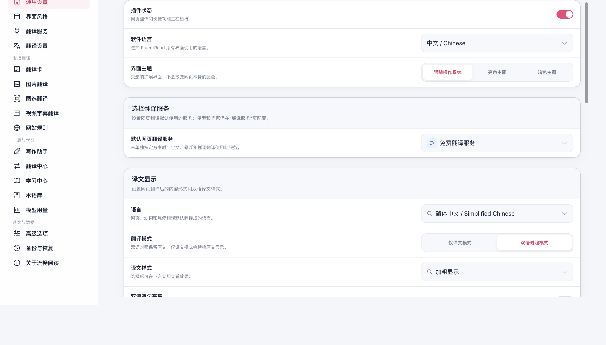
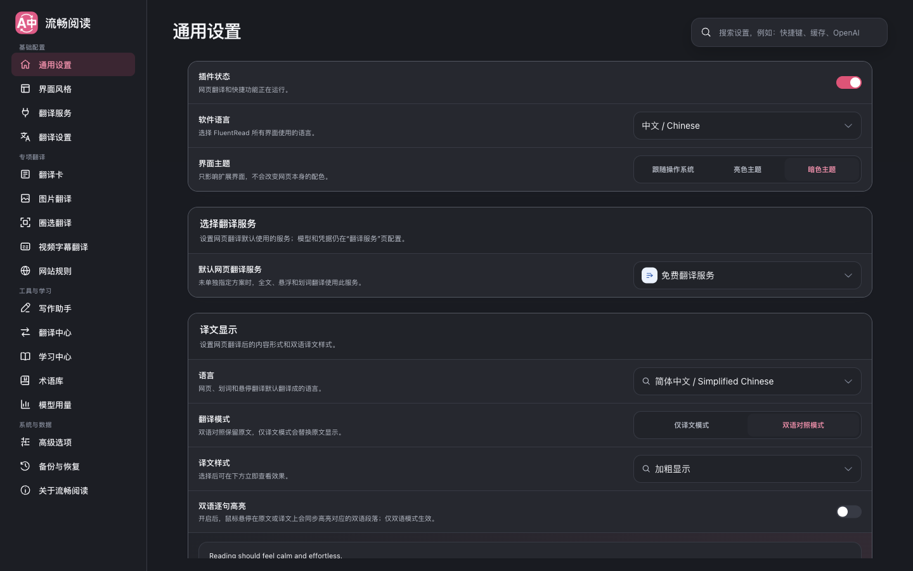

# 设置页面顶部裁切与底部空白修复

基线：`8ac04042`。修改仅涉及设置页面的布局和导航滚动，不改变配置字段、默认值或保存逻辑，未借鉴或修改参考项目。

## 复现与原因

在真实 Edge 的临时 profile 中加载基线生产包，首次打开设置页即可复现：可用视口高度 816 CSS 像素，外层文档高度却达到 1850 像素，`window.scrollY=94`，侧栏品牌和页面标题移出视口，底部留下空白。原生 `scrollIntoView()` 也能稳定触发相同现象。

内容区没有建立绝对定位包含块，表单中的 `.sr-only` 辅助文本向上使用文档作为定位边界，越过中间滚动容器的裁剪范围，撑高外层文档。导航、锚点或焦点滚动随后把整个页面带走。另外，分类切换此前重置的是 `window`，因此长表单的内容滚动位置会保留到下个分类。

## 修复

- 限定根页面与挂载容器的高度和溢出边界。
- 为 `.settings-card` 建立定位包含块，将绝对定位元素限制在实际内容滚动区。
- 分类 DOM 更新后只重置设置内容区的滚动位置；语言搜索仍可定位并聚焦对应控件。
- 桌面菜单保留独立纵向滚动，窄屏菜单保留横向滚动；长表单可滚动到最后一项。

## 验证

最终 Chrome 生产扩展的专项脚本通过 39 项检查，覆盖全部 17 个菜单、首次打开、分类切换回到顶部、通用/视频长表单底部、软件语言搜索和下拉菜单、原生锚点滚动、深链接刷新、1024/820/390 像素宽度、1440×480 矮窗口和深色主题。外层文档高度始终等于可用视口，文档和布局容器滚动偏移保持 0，控制台错误为 0。

运行模式为 `macos-background-cdp`，焦点策略为 `launchservices-no-foreground`，窗口完整位于第二显示器，`windowPlacement.mode=background-visible-no-focus`、`browserFrontmost=false`。测试结束关闭了本次创建的浏览器实例并删除临时 profile。

通过：`pnpm compile`、22 项导航测试、`pnpm build`、`pnpm build:firefox`、`pnpm docs:build`、`git diff --check`。Firefox 本轮只有构建验证，未做实机 UI 验证。

完整 UI 套件已针对最终生产包执行，但在 Popup 的旧标题 `/让阅读自然地流动|翻译功能已暂停/` 断言超时，尚未进入后续用例；主分支现有生产包复测也在相同位置失败，不能宣称完整套件通过。`pnpm test:audit` 同样存在已在主分支复核的基线失败：`tests/pageTranslationAdvanced.test.ts` 未登记到测试矩阵。

专项完整指标见 [浏览器报告](./settings-viewport-20260912/browser-report.json)。

## 截图

修复前：

修复后首次打开：

视频设置滚到底部：

窄屏和深色主题：

