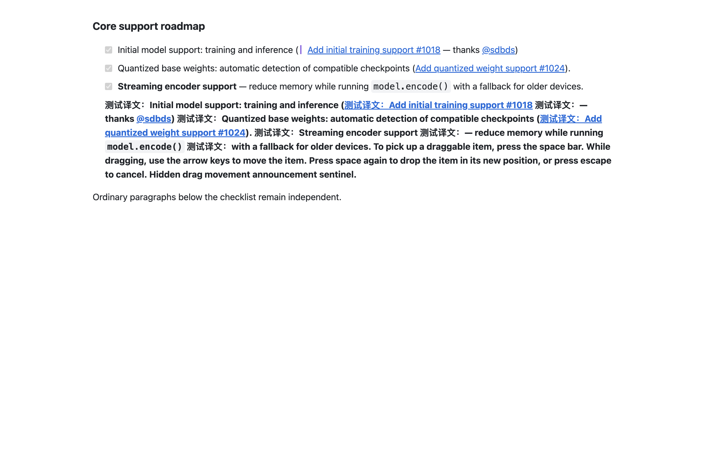
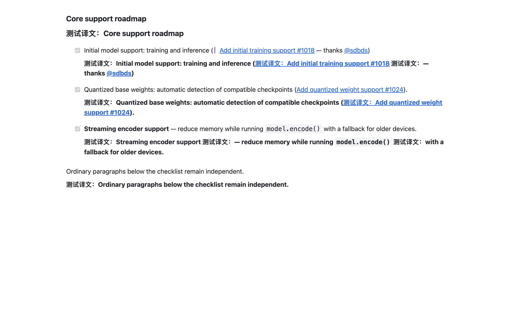
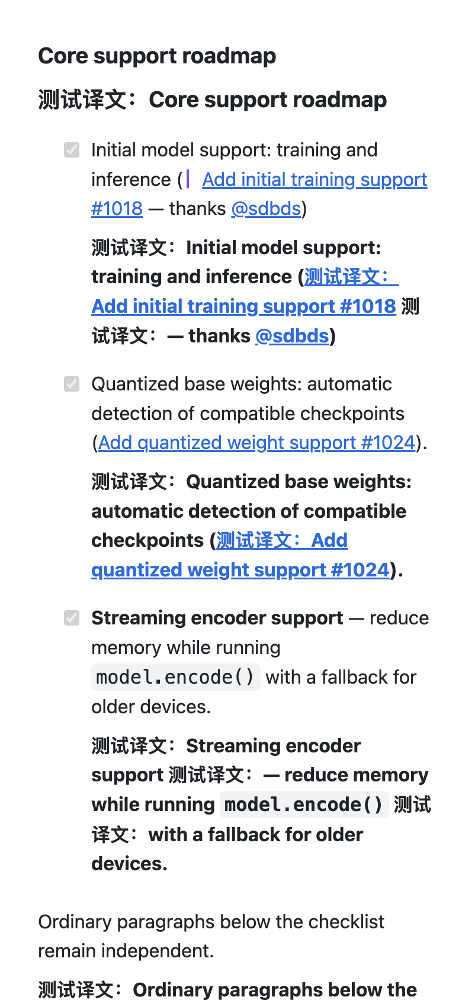

# 翻译核心行为审查与任务清单修复

本轮修复了四类真实缺陷：GitHub 动态任务清单被整组翻译、悬浮越过后代段落边界、隐藏或编辑内容在双语副本中重新出现，以及排队候选过期后可能改变宿主节点顺序。改动基于 `af88e8d7`，保持现有 Vue/WXT 架构和原生页面节点。

## 根因与行为变化

[用户报告的 Issue](https://github.com/kohya-ss/musubi-tuner/issues/1029) 在服务端 HTML 中是普通列表，浏览器加载后会重建结构：此次采集的 37 条任务变成内部正文 DIV，8 个外层 LI 各自包住一整组任务，另有 2 条普通 LI。之前把 `.markdown-body li` 默认当成原子段落，导致外层 LI 吞下整组。上一次针对普通嵌套列表的夹具没有包含这一结构。

内置 GitHub LI、引用、定义项、图注和表格单元格现在继续发现内部段落；真正的任务正文单独作为目标。只有叶内容才整体翻译。用户明确配置的原子目标继续遵循其设置。

通用悬浮选取现在保留已有后代候选的信息。命中透明的 custom/span 外壳时，如果里面已有独立段落，就不会退回翻译整个祖先。直接引导文字仍可单独翻译；256 步探测预算耗尽时保守放弃整块选取。

请求中的“保持原文”和副本中的“省略内容”分别处理。代码、禁译术语和可见公式保留；隐藏说明、编辑框、非展示脚本及辅助节点从双语克隆中省略，宿主节点不被删除。视觉隐藏识别要求微小定位盒、溢出裁剪和零面积剪裁共同成立，普通裁切卡片仍可翻译。

排队来源与落地渲染分别复验完整节点序列。首节点不变但中间新增、末尾追加、重排或新出现独立段落时，旧候选不再被接受；物化前也拒绝不连续、逆序和重复节点，避免搬动原文越过用户新内容。

## 参考实现与我们的取舍

详细的 [沉浸源码行为矩阵](./immersive-reference.md) 覆盖范围、块/内联边界、透明外壳、保留原文、隐藏内容、换行、坐标、划词、分帧、视口队列、动态扫描、状态、恢复及取消。用户提供的扩展实际为 **1.31.6**，油猴文件头为 **1.33.1**；两者不是相同版本。

本地陪读蛙的后序块边界传播、GitHub `task-lists` 规则和共享过滤，简约翻译的语义块分类、序列化复检与原节点恢复也进行了只读对照。当前 GitHub 页面已经没有 `task-lists` 元素，因此没有直接照搬这个旧选择器。没有复制参考代码、引入依赖或修改参考仓库。

采用共同的用户行为契约，而不是以压缩函数相似程度衡量对齐：

| 行为契约 | 本轮验证 |
| --- | --- |
| 范围容器继续遍历，列表/引用/表格按内容单元分段 | 新 GitHub 11 例、所有权 12 例；真实任务清单与既有嵌套列表浏览器验证 |
| 普通链接、强调与代码属于同一叶段落 | 新叶列表与透明外壳测试；独立复核另外比较 8 种短文本/链接形态的前后归属 |
| 悬浮与全文共享候选语义 | 冷/热悬浮、先发现后命中、正文/全部节点范围与预算不足测试 |
| 保留的原文、隐藏内容与编辑内容有不同输出语义 | 新快照 25 例、视觉隐藏 15 例，检查 provider 槽及最终 renderer 结果 |
| 识别与渲染之间重新验证来源 | 新时效 10 例，拒绝新增、重排、非连续、重复节点及宿主新段落 |
| 恢复不覆盖宿主修改，不复活已移除内容 | 新 SSR→hydration、readonly 用户值、hidden→visible→hidden 功能测试；原有 remount/replay 回归 |
| 取消、恢复、重译隔离每代结果 | `fullPageVisibilityScheduling`、`translationStability`、`translationState` 的取消与迟到结果断言；真实恢复/重译 |
| 控件、公式、换行、字体、显式原子规则继续正确 | 原有 control、truncation、advanced、font、prompts、selection 核心套件 |
| 扫描工作有界，页面可继续响应 | 256 步后代探测、300 层包裹、已有增量扫描与视口调度测试；4,000 槽线性映射、零兄弟路径扫描 |

FluentRead 保留自己的增量发现、8ms 扫描预算、逐代取消、宿主节点身份和双重来源复验。沉浸的 16ms 预算或“小于 4px”过滤是不同取舍，不能据此宣布整体性能优劣。本轮没有做两产品同时运行的 CPU、漏译率或服务质量排名。

## 验证结果

- 新增 **73 条单元/功能回归**，归入唯一测试分组，并加入覆盖率清单。旧实现分别复现隐藏副本 21 条失败、所有权 6 条失败和来源时效 8 条失败；不是只测试修复后文字是否出现。
- 相关 **33 个测试文件、1,149 条用例全部通过**，包含全文运行时、选取、状态、重挂、控件、公式、字体、提示词与站点目录。该范围是核心专项，不是全仓测试。
- 修改的 `dom.ts`、`engine.ts`、`serialization.ts`、`renderer.ts`、`translationStability.ts` 在同一次 V8 运行中 statements、branches、functions、lines 均为 **100%**，没有忽略或降低阈值。
- TypeScript/Vue 编译、Chrome/Firefox/userscript 生产构建和 userscript verifier 通过。构建没有修改版本号。
- 实际浏览器使用生产 Chrome MV3 产物，临时 Edge profile，第二屏正常窗口，`launchMode=macos-background-cdp`、`focusPolicy=launchservices-no-foreground`、`browserFrontmost=false`。
- 本地任务清单覆盖悬浮 `[1,0,1]`、全文/恢复/重译、390px 换行无横向溢出、动态增改、原生点击与节点身份、辅助状态更新不重复请求、克隆重挂和 503 后重试。
- 真实 Issue 的 **37 行分别为 1 个译文、8 个外层组均为 0**；正文总译文 `53→0→53`，无嵌套工件。恢复后正文 HTML 精确相等，188 个原生节点保持身份，隐藏提示请求/显示均为 0。
- 旧嵌套列表的 5 个独立内容单元验证 `5→0→5`，外层和嵌套译文均为 0。

浏览器翻译服务使用明确的本地确定性微软响应。真实 Issue 证明的是实时站点 DOM、生产扩展与操作链路，不是联网翻译质量、认证供应商、Firefox 实机或商店版本验收。原始证据保留在 `/private/tmp/fluentread-task-list-*`；精简计数、产物摘要和覆盖率见 [verification.json](./verification.json)。

## 重复运行

生产构建完成后运行本地专项；追加 `--live` 可验证当前真实 Issue DOM。`--baseline` 仅用于旧产物缺陷复现，不计作修复通过。

```bash
node scripts/testing/run-resource-safe.mjs -- node scripts/testing/run-github-task-list-test.cjs \
  --extension-dir .output/chrome-mv3 \
  --playwright-root <工作区 Node 包目录> \
  --focus-safe-helper <浏览器技能目录>/scripts/focus-safe-browser.cjs \
  --background --artifacts-dir /private/tmp/fluentread-task-list-check
```

新浏览器专项已注册到正式全量回归计划，但本轮只运行与改动直接相关的子集。






