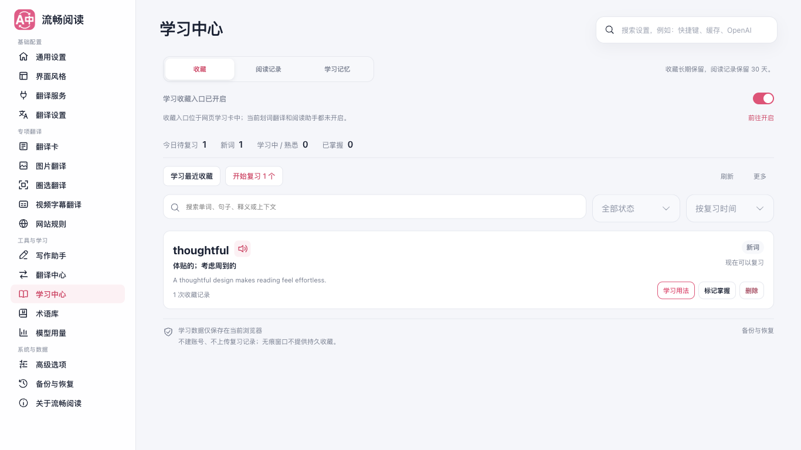
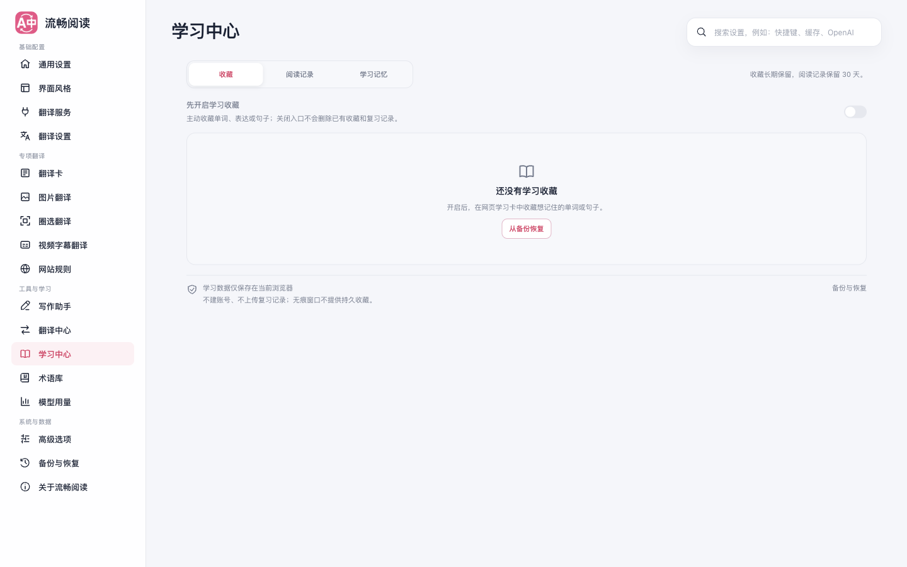
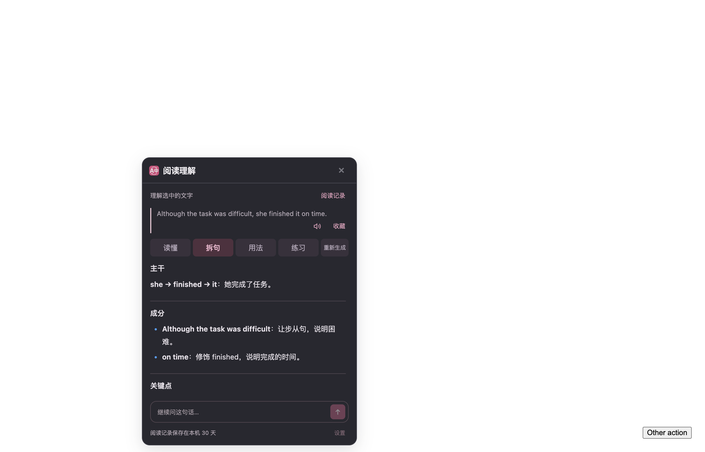
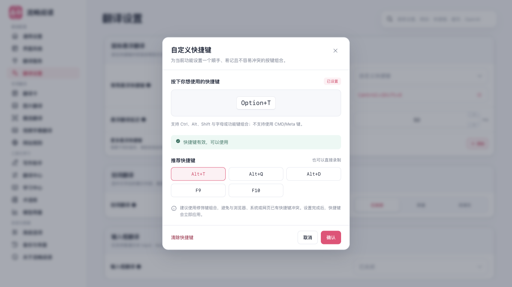

# 界面风格与使用流程审核

本轮以“用户进入页面后要做什么”为调整依据，覆盖 17 个设置分区、快捷键弹窗、Popup，以及阅读、写作和文档页面。重点减少辅助信息对正文和主要操作的遮挡。

## 修改

| 页面或组件 | 问题 | 调整后 |
| --- | --- | --- |
| 学习中心 | 开关、提示、四张统计卡和大按钮占满首屏 | 统计收成一行，操作改成小型工具栏，收藏列表成为主体；本地存储说明放到列表之后 |
| 学习中心首次使用 | 全零统计、空搜索和不可用按钮增加理解负担 | 没有收藏时只保留开启说明、收藏方法和恢复入口 |
| 学习中心复习 | 辅助信息与当前词条争夺注意力 | 复习时隐藏开关、提示、统计和存储说明，退出后恢复列表 |
| 术语库 | 内置模板排在用户自己的词库前面 | 先展示新建、导入与个人词库编辑，再提供模板；同步七种语言中的位置提示 |
| 快捷键弹窗 | 多层背景、重复小标题与大块预设卡片 | 保留录制、推荐组合和确认操作，使用统一表面、边框与焦点样式，窄屏内部滚动 |
| 翻译中心 | 固定颜色、深色数量徽标和窄屏标题拥挤 | 使用共享主题变量、轻量数量提示及可换行的语言说明 |
| 图标与反馈 | 系统文字字形和独立配色混用 | 导航、空态、搜索、备份等使用统一的本地 SVG；成功、警告与错误消息适配亮暗主题 |
| 阅读卡 | 暗色容器内仍有深色正文和浅色标签 | 修正 Vue scoped CSS 的祖先选择器，使正文、标签与 Markdown 表面真正跟随暗色；阅读卡背景不再透出网页文字 |
| 提示词编辑器、配置历史 | 同类暗色选择器丢失组件范围 | 修正组件选择器，避免规则退化成整个根元素的样式 |

既有主题预览、服务品牌图标和图表的含义配色保留。未借鉴或修改参考项目。没有修改供应商请求、配置存储、收藏数据结构或复习调度。

## 验证方式

使用生产 Chrome MV3 产物，在临时 Edge 配置中进行可见且不抢前台的浏览器检查；只关闭测试创建的实例。浏览器环境元数据、原始日志和临时配置不随报告发布。

- 设置审核脚本覆盖 17 个分区的亮色、暗色、390px 布局；另检查快捷键录制、推荐项与取消、收藏搜索、复习以及关闭入口后重开仍保留词条。
- 阅读卡使用本地合成内容与模型验证触发、设置重开和暗色正文对比度。
- 写作助手使用本地 GitHub/Gmail 页面及合成模型，验证暗色和窄屏展示、控件和设置。
- 文档流程使用本地确定性服务，验证支持格式、编辑、下载、失败恢复、批量任务与暗色窄屏。
- Firefox 仅验证生产构建；浏览器截图与交互证据来自 Edge，不代表 Firefox 实机或真实模型质量。

## 已完成的检查

- `pnpm compile`、`pnpm test:audit`、Chrome 与 Firefox 生产构建通过。
- 架构检查：27 个测试文件、890 个用例通过；快捷键、导航、收藏、术语库和界面配置相关 6 个文件、61 个用例通过；最终术语库/收藏/国际化复核 3 个文件、81 个用例通过；阅读面板生命周期 7 个用例通过。
- 设置视觉与学习流程审核 54 项通过，生成 78 张截图，无横向溢出或控制台错误。
- 阅读专项 14 个场景通过；暗色回答正文与背景对比度为 **11.27:1**。
- 写作展示专项 5 个场景通过；文档流程 11 个场景通过。以上专项未出现控制台错误。
- 外部 UI Skill 的完整套件仍等待旧 Popup 标题“让阅读自然地流动”，当前产品标题为“网页翻译”，因此超时；不能将专项通过表述为完整套件通过。

仓库设置回归已通过导航、搜索、加载效果、主题亮暗与响应式矩阵、多语言布局、Popup 菜单顺序/显隐保存等断言，随后停在模型用量请求记录默认收起的旧预期。主分支现有组件 `requestLogOpen` 初始值为 `true`，本轮没有修改该行为，因此这套脚本也未全量通过。

## 界面截图

### 已有收藏

### 首次使用

### 暗色阅读卡

### 快捷键录制

