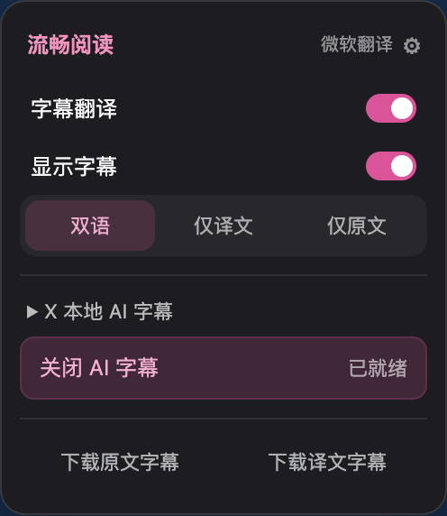
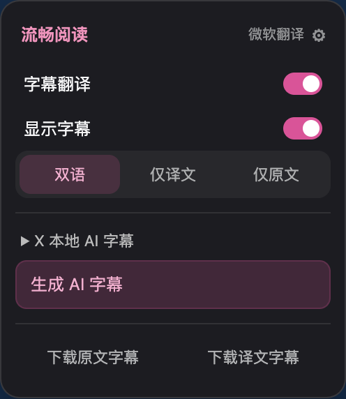

# 字幕菜单状态同步修复

X 播放器卸载原生控制栏后，FluentRead 会保留已打开的字幕菜单。此前菜单刷新同时要求入口按钮在 DOM 中，导致点击已生效，但开关、模式与 AI 状态仍显示旧值。现在菜单独立刷新，入口按钮存在时才更新其属性。

同一隔离 Edge 场景在修改前稳定复现：关闭 AI 后字幕消失，按钮仍为 `aria-checked=true`，文字仍是“关闭 AI 字幕 / 已就绪”。修改后按钮恢复为“生成 AI 字幕”，旧状态清除。

| 修改前 | 修改后 |
| --- | --- |
|  |  |

## 验证

- 91 项相关测试通过：菜单、本地化、播放器绑定、字幕显示、完整识别生命周期与缓存客户端。
- 源文件注释与模块边界检查通过；测试归类审计通过。
- TypeScript/Vue 检查、Chrome 和 Firefox 生产构建、文档构建通过。
- [浏览器报告](browser-report.json)：关闭/恢复 AI、连续隐藏/显示、三种模式、翻译开关、跨页面配置同步、AI 说明展开、重新识别错误反馈、两类字幕下载、设置入口、控制栏重挂载和 Esc。

浏览器使用临时 profile、`macos-background-cdp`、`launchservices-no-foreground`，正常尺寸窗口位于第二屏，`browserFrontmost=false`。使用生产扩展、X DOM 夹具、预置字幕缓存与固定翻译响应；重新识别注入一次模型查询失败。这些结果验证菜单与字幕显示状态，不代表真实 X 页面或 Whisper 识别质量验证。未借鉴参考仓库。

复测入口为 `scripts/run-video-menu-state-test.cjs`，需传入 `--extension-dir`、`--playwright-root`、`--focus-safe-helper` 和 `--artifacts-dir`；默认使用后台隔离 Edge，不连接日常浏览器配置。
