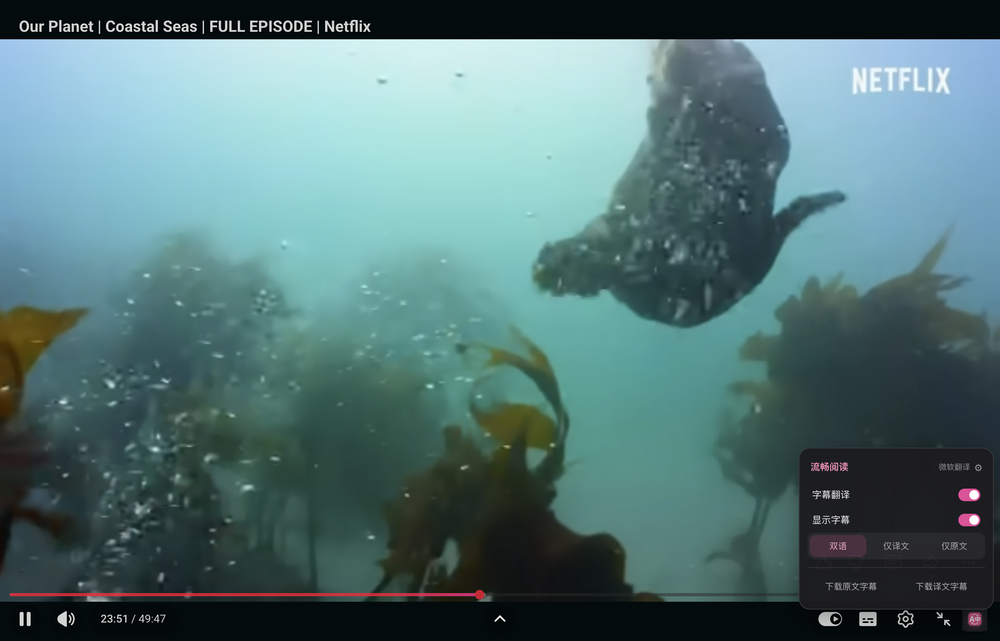
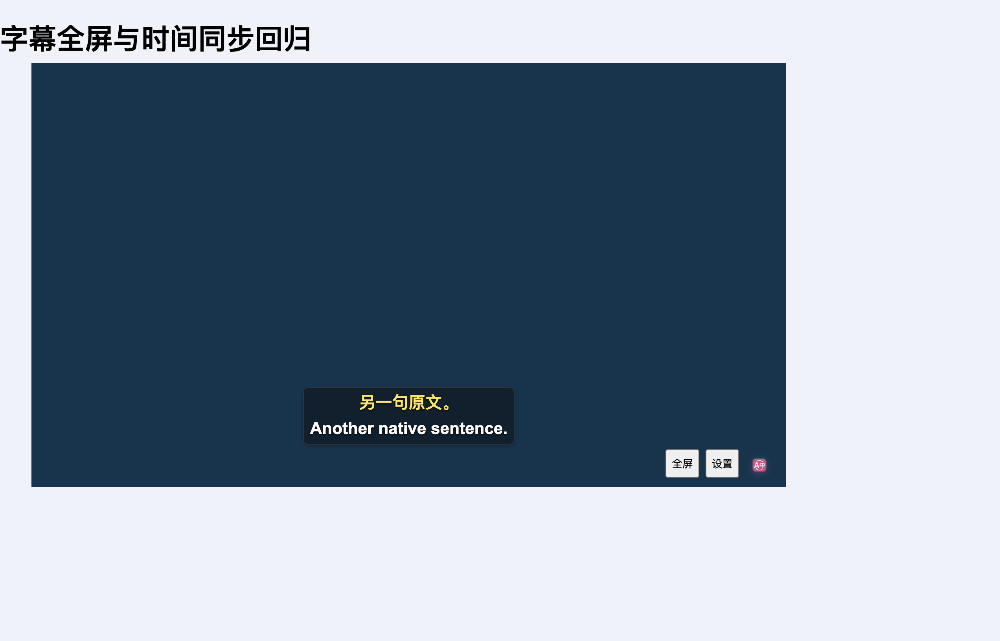

# YouTube 全屏菜单与字幕同步验证

2026-09-13，基于 `50b5c39e` 修复。真实页面为 [Our Planet · Coastal Seas](https://www.youtube.com/watch?v=r9PeYPHdpNo&t=1426s)。

## 问题与修复

- YouTube 将 `html` 设为全屏，实际播放器通过固定定位铺满窗口。旧实现把菜单与字幕层迁到高度为 0 的 `html`，菜单顶部落在视口外（实测 `top=-62px`），字幕层高度为 0。修复后继续挂在实际 `#movie_player` 内，支持进入和退出全屏。
- 旧字幕匹配可以从其他时段选中相同文本或前缀，也会用下一条时间轴字幕替换尚未更新的原生文本。现在同时检查原生文本和 cue 的起止时间，不提前借用未来句子。
- 旧实现等待 120ms 再处理 YouTube 字幕变动，原文清空后仍保留译文 420ms。现在及时清理旧显示及异步资格，整句和逐词字幕都在同一双语面板中显示；译文尚未就绪时先保留当前原文。
- 仅在当前播放器内读取原生字幕，避免使用其他残留播放器的文本。用户保存的字幕显示模式、位置、颜色、字体、服务配置均保留。

## 验证范围

| 检查 | 结果与边界 |
| --- | --- |
| 字幕、播放器与架构专项 | 12 个测试文件、844 项通过；未运行全量套件 |
| 字幕匹配与播放器定位覆盖率 | 两个纯逻辑模块四项覆盖率均为 100%；不代表整个运行时覆盖率 |
| TypeScript、测试审计 | 通过 |
| Chrome / Firefox 生产构建、文档构建 | 通过；Firefox 未做实机验证 |
| 新增 YouTube 浏览器专项 | 15 项通过：文档全屏、菜单切换、稳定定位、重复句、过期/未来字幕、延迟返回、真实视频 seek、空档、原文模式与清理 |
| 现有视频字幕浏览器回归 | 通过，含开关持久化、显示模式、原文/译文下载、10 秒与 30 秒预取、字幕对齐 |
| X 播放器菜单回归 | 9 项通过，含原生控制栏卸载/重挂载、开关、模式、缓存恢复与下载；使用受控字幕和模拟翻译 |
| 真实 YouTube 全屏菜单 | 在上述视频中复现并确认修复，菜单可见、命中检测和模式切换正常；全屏字幕层恢复到播放器尺寸 |
| 真实 YouTube 字幕翻译 | 未能验证：隔离匿名窗口中的英语原生字幕接口返回 HTTP 200、空响应，原生字幕本身未出现 |

浏览器专项使用生产扩展、临时 Edge profile、第二屏后台窗口：`launchMode=macos-background-cdp`、`focusPolicy=launchservices-no-foreground`、`windowPlacement.mode=background-visible-no-focus`、`browserFrontmost=false`。字幕时序夹具使用真实视频进度、受控页面字幕和模拟翻译服务，不代表真实服务翻译质量。

未借鉴或修改参考仓库。

## 截图

真实视频中的全屏菜单：

受控字幕夹具中的统一双语面板：

复现命令见 [测试与回归](../../testing.md#youtube-全屏与字幕同步)。
