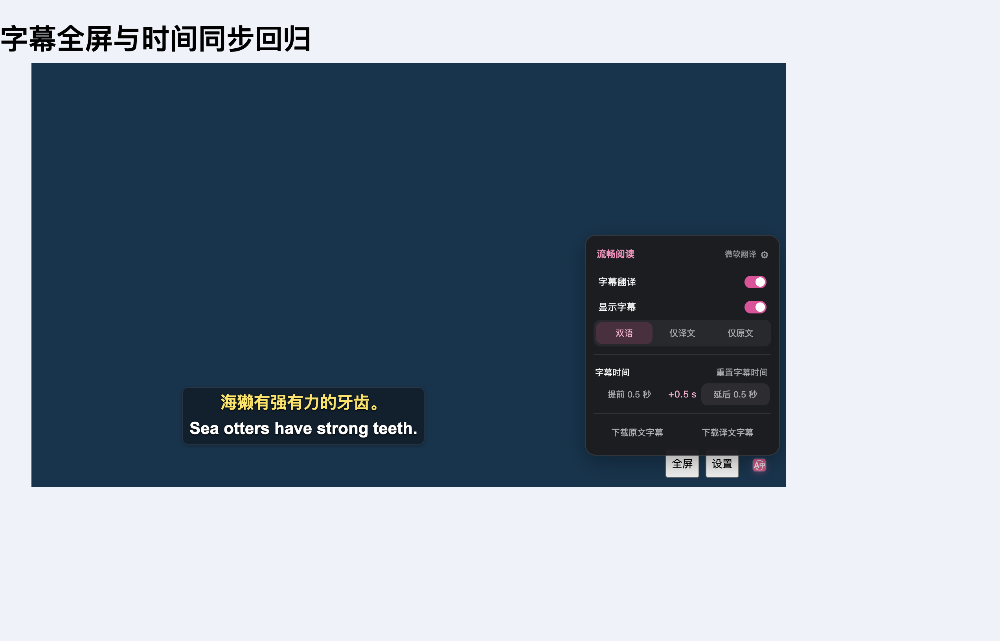
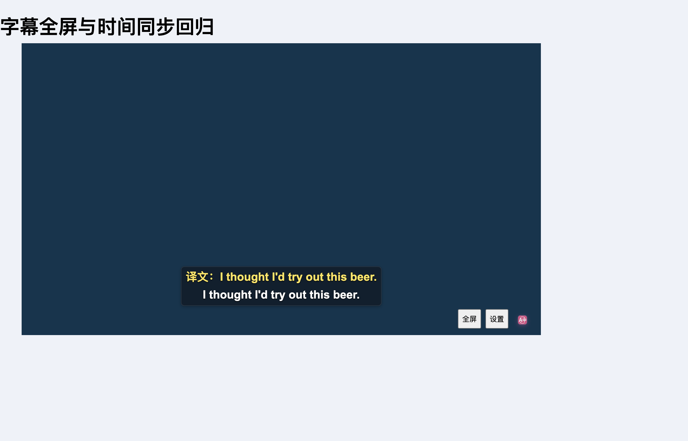

# YouTube 流式字幕延迟与播放页校时

播放页面的 FluentRead 字幕菜单新增“提前 0.5 秒 / 延后 0.5 秒”和重置。偏移默认 0、范围 ±10 秒，自动保存、跨页同步，适用于可读取时间轴的 YouTube 与 X 字幕。正数延后、负数提前；两行字幕一起移动，播放进度和下载字幕数据不变。无时间轴时显示不可调整提示，但已有偏移仍可重置。

## 自动同步修复

- YouTube 滚动窗口裁掉的旧行不再进入当前原文。
- “上一句 + 下一句开头”的滚动内容使用末尾完整词匹配当前有效 cue，避免等旧行滚走才切换预译文；保留时间区间和字幕原文的约束。
- 无可用预取匹配时，稳定等待从 360ms 缩短到 80ms，连续更新的等待上限为 240ms；沿用单个请求循环合并最新待译文字和迟到结果隔离。
- 手动偏移由播放器时钟驱动，支持提前显示下一句、延后显示上一句、时间轴空档、仅原文显示，以及播放、暂停和跳转。空档不露出未偏移的原生字幕。

## 验证

- 11 个相关 Vitest 文件共 317 个用例通过，覆盖字幕数据、选择逻辑、菜单、设置归一化、配置保存与界面语言。
- `subtitleLogic.ts` 与 `playerMenu.ts` 的 statements / branches / functions / lines 均为 100%，共 20 项针对性覆盖率用例。
- 生产 Chrome 扩展通过 YouTube 浏览器专项 29 项检查。最终一次测试中，原文变更到发出请求为 159ms；每 40ms 连续增词时，首个请求为 246ms。该时间包含调度开销，不包含真实翻译服务响应时间。
- 生产扩展的 X 原生 TextTrack 专项通过，验证半秒提前/延后、重置、播放位置保持、字幕外观、下载及原生轨道恢复；ASR 和模型准备调用均为 0。夹具补齐当前播放器要求的设置控制栏，并在切换控制栏场景时移除旧控件。
- TypeScript/Vue 编译、Chrome / Firefox 构建、用户脚本构建及 verifier、文档构建、测试分类审计、源码职责注释检查通过。未运行全量回归。
- 浏览器为独立临时 Edge profile，`launchMode=macos-background-cdp`、`focusPolicy=launchservices-no-foreground`、`windowPlacement.mode=background-visible-no-focus`、`browserFrontmost=false`；没有连接日常浏览器配置。

完整断言与生产文件 SHA-256 见 [verification.json](./verification.json)。

## 实测限制与已有失败

用户提供的视频在隔离浏览器中可以播放，但其原生 timedtext 接口返回 HTTP 200、空内容，没有出现可测量的原生字幕。因此本次没有验证该视频与真实翻译服务组合的端到端字幕延迟，也不承诺字幕零延迟。自动同步和校时结果来自生产扩展与可控制的字幕、视频、翻译响应。

`tests/architecture/verificationOwnership.test.ts` 的验证归属检查仍报告 `scripts/wasm/diagnostics.js` 和 `scripts/wasm/package-diagnostics.ts` 缺少归属；已在未修改的 main（`25ceead4`）复现，本次没有修改该检查或 WASM 文件。

本次使用 FluentRead 自身架构独立实现，没有复制或修改参考仓库。
